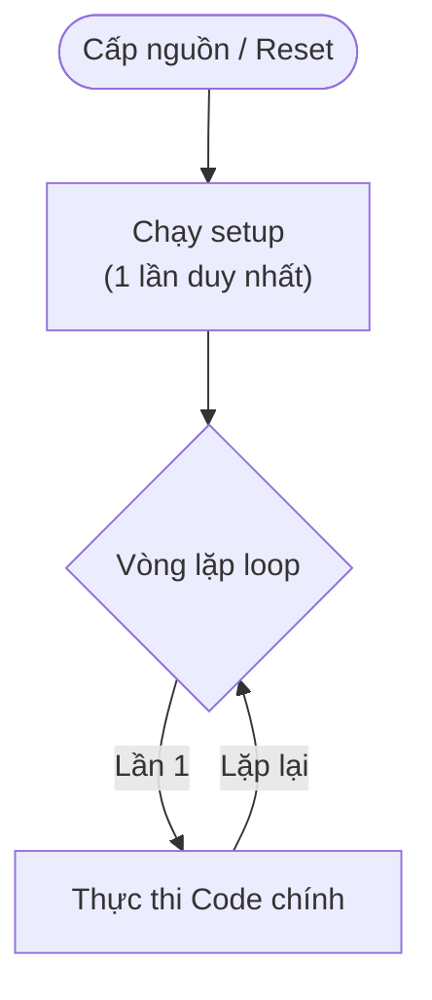

# Tuần 1: Tổng quan Hệ thống Nhúng & GPIO (Điều khiển LED)

> [!IMPORTANT]
> **Thời lượng**: 3 tiết lý thuyết + 2 tiết thực hành  
> **Mục tiêu**: Làm quen Arduino Uno/ESP32, hiểu cấu trúc chương trình, điều khiển LED cơ bản

---

## 🎯 Mục tiêu học tập

Sau khi hoàn thành tuần này, bạn sẽ:

1. ✅ Hiểu Arduino Uno là gì và vai trò trong hệ thống nhúng
2. ✅ Nắm vững cấu trúc chương trình Arduino: `setup()` và `loop()`
3. ✅ Sử dụng thành thạo `pinMode()`, `digitalWrite()`, `delay()`
4. ✅ Điều khiển LED đơn và nhiều LED theo quy luật thời gian
5. ✅ Viết code sạch với mảng, vòng lặp, và tách hàm

---

## 📚 Phần 1: Lý thuyết dân dã (Dễ hiểu nhất)

### 1.1 Hệ thống nhúng là gì? (Tưởng tượng cái máy giặt)

Hãy nhìn cái **máy giặt** hay cái **nồi cơm điện** nhà bạn.
- Chúng có "bộ não" không? **Có**, vì chúng biết đếm giờ, biết khi nào nước đầy thì dừng, biết nấu xong thì tít tít.
- Chúng có lướt Facebook hay chơi game được không? **Không**.

👉 **Hệ thống nhúng** chính là những "bộ não" nhỏ bé đó. Chúng chỉ sinh ra để làm **một việc duy nhất** (như giặt đồ, nấu cơm) nhưng làm cực tốt và bền bỉ.

> **Khác với Laptop**: Laptop là "đa năng" (làm gì cũng được). Hệ thống nhúng là "chuyên biệt" (chỉ làm 1 việc).

### 1.2 Arduino Uno là gì?

Thực ra con chip (vi điều khiển) rất khó dùng. Người ta tạo ra cái bo mạch **Arduino Uno** để giúp những người mới học (như bạn) có thể "giao tiếp" với con chip đó dễ dàng hơn.

- **Con chip ATmega328P**: Là "bộ não".
- **Các chân cắm (Hàng lỗ đen đen)**: Là "tay chân". Bạn cắm đèn vào đó, bộ não sẽ điều khiển đèn. Bạn cắm nút bấm vào đó, bộ não sẽ cảm nhận được nút bấm.

### 1.3 Cấu trúc Code: "Ông đầu bếp" và "Công việc hàng ngày"

Code Arduino luôn có 2 phần chính. Hãy tưởng tượng bạn mở một quán phở:

1.  **`void setup()` - Khâu chuẩn bị (Chỉ làm 1 lần lúc mở cửa)**
    - Bạn lau bàn, xếp ghế, bật bếp.
    - Trong code cũng vậy: Bạn bảo Arduino "Chân này nối đèn nhé", "Chân kia nối nút bấm nhé".
    - Nó chỉ chạy **đúng 1 lần** khi bạn cấp điện.

2.  **`void loop()` - Phục vụ khách (Lặp đi lặp lại mãi mãi)**
    - Có khách -> Làm phở -> Bưng ra -> Thu tiền. Rồi lại có khách...
    - Trong code: Kiểm tra nút bấm -> Bật đèn -> Tắt đèn... Cứ thế lặp lại siêu nhanh (hàng nghìn lần mỗi giây) cho đến khi... mất điện.

### 1.4 GPIO (Tay chân của Arduino)

Tên tiếng Anh nghe kêu (Global Purpose Input/Output) nhưng thực ra nó chỉ là các cái **Cổng (Pin)**:
- **OUTPUT (Xuất ra)**: Arduino ra lệnh.
    - *Ví dụ*: Bật đèn, còi kêu, động cơ quay. (Arduino là sếp, thiết bị phải nghe).
- **INPUT (Nhập vào)**: Arduino lắng nghe.
    - *Ví dụ*: Đọc nút bấm, đọc cảm biến nhiệt độ. (Thiết bị báo cáo, Arduino nghe).

### 1.5 Tại sao LED cần điện trở? (Nguyên lý Ống nước)

Hãy tưởng tượng dòng điện như **nước chảy trong ống**:
- **Pin 5V**: Là cái máy bơm cực mạnh.
- **Đèn LED**: Là cái cánh quạt giấy mỏng manh.

Nếu bạn nối thẳng máy bơm vào cánh quạt -> **RÁCH (Cháy LED)**.
👉 Bạn cần bóp ống nước lại một chút để nước chảy từ từ thôi. Cái chỗ "bóp ống" đó chính là **Điện trở**.

> **Quy tắc sống còn**: Luôn nối tiếp LED với điện trở 220Ω (đỏ-đỏ-nâu) hoặc 330Ω (cam-cam-nâu).

### 1.6 `delay()` - Đi ngủ đông

Lệnh `delay(1000)` nghĩa là: "Này Arduino, hãy ngủ 1000 mili-giây (1 giây) đi, đừng làm gì cả".
- **Ưu điểm**: Dễ dùng. Muốn nháy đèn thì cứ Bật -> Ngủ -> Tắt -> Ngủ.
- **Nhược điểm**: Lúc nó đang ngủ, nếu có trộm vào nhà (bạn nhấn nút), nó sẽ **không biết gì cả**. (Tuần sau ta sẽ học cách "vừa canh nhà vừa nghỉ ngơi" sau).

### 1.1 Hệ thống nhúng là gì?

**Hệ thống nhúng (Embedded System)** là một hệ thống máy tính được thiết kế để thực hiện một hoặc một vài chức năng chuyên biệt, thường nằm bên trong một thiết bị lớn hơn.

#### Ví dụ thực tế:
- 🚗 **Ô tô**: Hệ thống ABS, túi khí, điều hòa tự động
- 🏠 **Nhà thông minh**: Đèn cảm biến, khóa cửa vân tay
- 📱 **Điện thoại**: Cảm biến vân tay, gyroscope
- 🎮 **Game console**: Điều khiển tay cầm, xử lý đồ họa

#### Đặc điểm của hệ thống nhúng:
| Đặc điểm | Mô tả |
|----------|-------|
| **Chuyên biệt** | Làm một việc và làm tốt |
| **Thời gian thực** | Phản hồi nhanh, đúng deadline |
| **Tài nguyên hạn chế** | RAM ít, CPU chậm hơn PC |
| **Tiêu thụ điện thấp** | Chạy pin, tiết kiệm năng lượng |

### 1.2 Arduino Uno - Board học tập lý tưởng

**Arduino Uno** là board vi điều khiển phổ biến nhất cho người mới (chip ATmega328P, 5V).
**ESP32** là dòng chip mạnh mẽ hơn, tích hợp WiFi/Bluetooth (chip 32-bit, 3.3V).

> [!CAUTION]
> **Lưu ý Quan trọng về Điện áp**:
> - **Arduino Uno**: Logic **5V**.
> - **ESP32**: Logic **3.3V**. Cấp 5V vào chân GPIO của ESP32 có thể làm cháy chip!

#### Thông số kỹ thuật:
| Thông số | Giá trị |
|----------|---------|
| **Vi xử lý** | ATmega328P |
| **Điện áp hoạt động** | 5V |
| **Tần số xung nhịp** | 16 MHz |
| **Flash Memory** | 32 KB (chứa chương trình) |
| **SRAM** | 2 KB (biến runtime) |
| **EEPROM** | 1 KB (lưu dữ liệu khi tắt nguồn) |
| **Digital I/O Pins** | 14 (6 có PWM) |
| **Analog Input Pins** | 6 |

#### Sơ đồ chân Arduino Uno:
```
                    +-----[USB]-----+
                    |               |
              RESET |[ ]   [ ][ ][ ]| D13 (LED_BUILTIN)
               3.3V |[ ]   [ ][ ][ ]| D12 
                 5V |[ ]   [ ][ ][ ]| D11 (PWM)
                GND |[ ]   [ ][ ][ ]| D10 (PWM)
                GND |[ ]   [ ][ ][ ]| D9  (PWM)
                Vin |[ ]   [ ][ ][ ]| D8
                    |               |
                 A0 |[ ]       [ ][ ]| D7
                 A1 |[ ]       [ ][ ]| D6  (PWM)
                 A2 |[ ]       [ ][ ]| D5  (PWM)
                 A3 |[ ]       [ ][ ]| D4
            SDA/A4  |[ ]       [ ][ ]| D3  (PWM)
            SCL/A5  |[ ]       [ ][ ]| D2
                    |               |
                    +---------------+
```

### 1.3 Cấu trúc chương trình Arduino

Mọi chương trình Arduino đều có **hai hàm bắt buộc**:

```cpp
void setup() {
    // Chạy MỘT LẦN DUY NHẤT khi khởi động
    // Dùng để: cấu hình pin, khởi tạo Serial, thiết lập ban đầu
}

void loop() {
    // Chạy LẶP LẠI VÔ HẠN sau khi setup() hoàn tất
    // Dùng để: logic chính của chương trình
}
```

#### Luồng thực thi:



### 1.4 GPIO - General Purpose Input/Output

**GPIO** là các chân đa năng, có thể cấu hình làm **INPUT** (đọc tín hiệu) hoặc **OUTPUT** (xuất tín hiệu).

#### Các hàm GPIO cơ bản:

```cpp
// 1. Cấu hình chế độ chân
pinMode(pin, mode);
// - pin: số chân (2-13 hoặc A0-A5)
// - mode: INPUT, OUTPUT, hoặc INPUT_PULLUP

// 2. Xuất tín hiệu số
digitalWrite(pin, value);
// - value: HIGH (5V) hoặc LOW (0V)

// 3. Đọc tín hiệu số
int state = digitalRead(pin);
// - state: HIGH hoặc LOW
```

### 1.5 LED và điện trở hạn dòng

#### Tại sao LED cần điện trở?

LED (Light Emitting Diode) có đặc tính: khi có điện áp thuận, dòng điện tăng **rất nhanh** và có thể làm cháy LED nếu không giới hạn.

**Công thức tính điện trở hạn dòng:**
```
R = (Vnguồn - Vled) / Iled

Với Arduino 5V và LED đỏ (Vled ≈ 2V, Iled = 20mA):
R = (5V - 2V) / 0.02A = 150Ω

→ Thường dùng 220Ω hoặc 330Ω để an toàn
```

#### Sơ đồ kết nối LED cơ bản:
```
Arduino Pin D2 ──[220Ω]──┐
                         │
                       (+)LED(-)
                         │
                        GND
```

### 1.6 Hàm delay() và nhược điểm

```cpp
delay(ms);  // Tạm dừng chương trình trong ms mili-giây
```

**Ưu điểm**: Đơn giản, dễ dùng  
**Nhược điểm**: 
- ⚠️ **Blocking** - CPU không làm gì khác trong lúc chờ
- ⚠️ Không phản hồi được nút nhấn, cảm biến trong lúc delay
- ⚠️ Tuần sau sẽ học cách tốt hơn với `millis()`

---

## 🔌 Chuẩn bị phần cứng (Hardware Setup)

Để làm các bài tập bên dưới, bạn cần đấu nối như sau:

> **Quy tắc vàng**: **Chân Dài (+) đi vào Pin, Chân Ngắn (-) đi xuống Đất (GND)**.
> Đừng quên điện trở, nếu không LED sẽ cháy "bụp" một cái đấy!

```
[Pin 13] ──── [Điện trở 220Ω (Đỏ-Đỏ-Nâu)] ──── (+) LED (-) ──── [GND]
```
*(Hoặc đơn giản là nhìn vào cái đèn L có sẵn trên mạch Arduino)*

---

## 🧱 Phần 2: Bài tập khởi động (Warm-up)

Trước khi làm các bài phức tạp, hãy làm các bài nhỏ này để hiểu cơ bản.

### 2.1 Drill 1: Bật LED sáng mãi mãi (Hello LED)
**Mục tiêu**: Kiểm tra mạch và lệnh `digitalWrite`.

```cpp
void setup() {
    pinMode(13, OUTPUT);     // Cấu hình chân 13 là OUTPUT
    digitalWrite(13, HIGH);  // Bật LED (cấp điện 5V)
}

void loop() {
    // Không làm gì cả, LED vẫn sáng vì đã bật ở setup
}
```
**Thử thách**: Sửa `HIGH` thành `LOW` để tắt LED.

### 2.2 Drill 2: Nháy LED chậm (Manual Blink)
**Mục tiêu**: Hiểu luồng chạy của `loop()`.

```cpp
void setup() {
    pinMode(13, OUTPUT);
}

void loop() {
    digitalWrite(13, HIGH);  // Bật
    delay(2000);             // Chờ 2 giây
    digitalWrite(13, LOW);   // Tắt
    delay(2000);             // Chờ 2 giây
    // Hết loop, nó sẽ quay lại dòng đầu của loop -> Lặp vô hạn
}
```
**Thử thách**: Sửa code để LED bật 0.1 giây (nháy siêu nhanh) và tắt 1 giây.

### 2.3 Drill 3: Sử dụng biến (Variable)
**Mục tiêu**: Hiểu tại sao cần biến.

```cpp
int timeOn = 1000;   // Biến lưu thời gian bật
int timeOff = 500;   // Biến lưu thời gian tắt

void setup() {
    pinMode(13, OUTPUT);
}

void loop() {
    digitalWrite(13, HIGH);
    delay(timeOn);          // Dùng giá trị của biến timeOn
    digitalWrite(13, LOW);
    delay(timeOff);         // Dùng giá trị của biến timeOff
}
```
**Thử thách**: Sửa `timeOn` thành 5000 (5 giây) ở dòng khai báo biến.

---

## 💻 Phần 3: Code mẫu nâng cao

### 2.1 Blink LED cơ bản (Hello World của Arduino)

```cpp
/*
 * Bài 1: Blink LED - Chương trình đầu tiên
 * LED nháy 1 giây bật, 1 giây tắt
 * 
 * Phần cứng:
 * - LED đỏ nối từ D13 qua điện trở 220Ω xuống GND
 * - Hoặc dùng LED_BUILTIN (LED trên board)
 */

const int LED_PIN = 13;  // Chân kết nối LED

void setup() {
    pinMode(LED_PIN, OUTPUT);  // Cấu hình chân làm OUTPUT
}

void loop() {
    digitalWrite(LED_PIN, HIGH);  // Bật LED (5V)
    delay(1000);                   // Chờ 1 giây (1000ms)
    
    digitalWrite(LED_PIN, LOW);   // Tắt LED (0V)
    delay(1000);                   // Chờ 1 giây
}
```

### 2.2 Hàm blinkN() - Nháy LED theo số lần

```cpp
/*
 * Bài 1-1: Điều khiển LED theo quy luật thời gian
 * 
 * Yêu cầu:
 * 1) Bật 1s, tắt 1s, lặp 5 lần
 * 2) Bật 3s, tắt 0.5s, lặp 5 lần  
 * 3) Bật 0.5s, tắt 3s, lặp 5 lần
 */

const int LED_PIN = 2;  // LED nối vào chân D2

// Hàm nháy LED n lần với thời gian bật và tắt tùy chỉnh
void blinkN(int tOnMs, int tOffMs, int n) {
    for (int i = 0; i < n; i++) {
        digitalWrite(LED_PIN, HIGH);
        delay(tOnMs);
        
        digitalWrite(LED_PIN, LOW);
        delay(tOffMs);
    }
}

void setup() {
    pinMode(LED_PIN, OUTPUT);
    Serial.begin(9600);  // Bật Serial để theo dõi
    
    Serial.println("=== Bắt đầu chương trình ===");
}

void loop() {
    // Quy luật 1: Bật 1s, tắt 1s, lặp 5 lần
    Serial.println("Quy luật 1: 1s ON / 1s OFF x 5");
    blinkN(1000, 1000, 5);
    delay(2000);  // Nghỉ 2s giữa các quy luật
    
    // Quy luật 2: Bật 3s, tắt 0.5s, lặp 5 lần
    Serial.println("Quy luật 2: 3s ON / 0.5s OFF x 5");
    blinkN(3000, 500, 5);
    delay(2000);
    
    // Quy luật 3: Bật 0.5s, tắt 3s, lặp 5 lần
    Serial.println("Quy luật 3: 0.5s ON / 3s OFF x 5");
    blinkN(500, 3000, 5);
    delay(2000);
    
    Serial.println("=== Lặp lại từ đầu ===\n");
}
```

### 2.3 Điều khiển 5 LED tuần tự

```cpp
/*
 * Bài 1-2: Điều khiển 5 LED (D2–D6) theo quy tắc
 * 
 * Yêu cầu:
 * - Bật tuần tự LED1→LED5, cách 1s giữa các LED
 * - Giữ tất cả LED sáng 5s
 * - Tắt tuần tự LED5→LED1, cách 1s
 */

// Sử dụng mảng để quản lý nhiều LED
const int LED_PINS[] = {2, 3, 4, 5, 6};
const int NUM_LEDS = 5;

void setup() {
    Serial.begin(9600);
    
    // Cấu hình tất cả LED pins làm OUTPUT
    for (int i = 0; i < NUM_LEDS; i++) {
        pinMode(LED_PINS[i], OUTPUT);
        digitalWrite(LED_PINS[i], LOW);  // Tắt hết ban đầu
    }
    
    Serial.println("=== 5 LED Sequential Control ===");
}

void loop() {
    // Phase 1: Bật tuần tự từ LED1 → LED5
    Serial.println("Phase 1: Bật tuần tự →");
    for (int i = 0; i < NUM_LEDS; i++) {
        digitalWrite(LED_PINS[i], HIGH);
        Serial.print("LED ");
        Serial.print(i + 1);
        Serial.println(" ON");
        delay(1000);
    }
    
    // Phase 2: Giữ tất cả sáng 5 giây
    Serial.println("Phase 2: Giữ sáng 5s...");
    delay(5000);
    
    // Phase 3: Tắt tuần tự từ LED5 → LED1
    Serial.println("Phase 3: Tắt tuần tự ←");
    for (int i = NUM_LEDS - 1; i >= 0; i--) {
        digitalWrite(LED_PINS[i], LOW);
        Serial.print("LED ");
        Serial.print(i + 1);
        Serial.println(" OFF");
        delay(1000);
    }
    
    Serial.println("=== Hoàn thành 1 chu kỳ ===\n");
    delay(2000);  // Nghỉ trước khi lặp lại
}
```

### 2.4 Hiệu ứng LED đuổi (Knight Rider / Running LEDs)

```cpp
/*
 * Bài 1-3: Điều khiển 5 LED "duy nhất một LED sáng"
 * 
 * Yêu cầu:
 * - Duy nhất 1 LED sáng chạy 1→5, trễ 1s
 * - Duy nhất 1 LED sáng chạy 5→1, trễ 0.5s
 */

const int LED_PINS[] = {2, 3, 4, 5, 6};
const int NUM_LEDS = 5;

// Hàm tắt tất cả LED
void allOff() {
    for (int i = 0; i < NUM_LEDS; i++) {
        digitalWrite(LED_PINS[i], LOW);
    }
}

// Hàm bật duy nhất 1 LED tại vị trí index
void onlyOne(int index) {
    allOff();
    digitalWrite(LED_PINS[index], HIGH);
}

void setup() {
    Serial.begin(9600);
    
    for (int i = 0; i < NUM_LEDS; i++) {
        pinMode(LED_PINS[i], OUTPUT);
    }
    allOff();
    
    Serial.println("=== Knight Rider Effect ===");
}

void loop() {
    // Chạy từ trái sang phải (LED1 → LED5), delay 1s
    Serial.println("→ Forward (1s delay)");
    for (int i = 0; i < NUM_LEDS; i++) {
        onlyOne(i);
        delay(1000);
    }
    
    // Chạy từ phải sang trái (LED5 → LED1), delay 0.5s
    Serial.println("← Backward (0.5s delay)");
    for (int i = NUM_LEDS - 1; i >= 0; i--) {
        onlyOne(i);
        delay(500);
    }
}
```

---

## ⚠️ Phần 4: Lỗi thường gặp & Cách khắc phục

### 3.1 LED không sáng

| Nguyên nhân | Cách kiểm tra | Cách sửa |
|-------------|---------------|----------|
| LED ngược chiều | Đổi chiều chân LED | Chân dài (+) vào pin, chân ngắn (-) vào GND |
| Quên điện trở | LED cháy hoặc quá tối | Thêm điện trở 220Ω |
| Sai số chân | `pinMode` không đúng pin | Kiểm tra lại số chân trong code |
| Thiếu GND chung | Mạch hở | Nối GND của breadboard vào GND Arduino |

### 3.2 LED sáng nhưng không nháy

- **Nguyên nhân**: Quên gọi `pinMode()` trong `setup()`
- **Cách sửa**: Thêm `pinMode(LED_PIN, OUTPUT);`

### 3.3 Chương trình không upload được

| Lỗi | Nguyên nhân | Cách sửa |
|-----|-------------|----------|
| "Port not found" | Chưa cắm cable / driver lỗi | Cài driver CH340 hoặc CP2102 |
| "avrdude: stk500_recv" | Sai board/port | Tools → Board: Arduino Uno |
| "Compilation error" | Lỗi cú pháp | Đọc kỹ thông báo lỗi |

### 3.4 Checklist debug nhanh

1. ✅ Cáp USB có truyền **dữ liệu** (không phải cáp sạc)?
2. ✅ Chọn đúng **Board**: Arduino Uno?
3. ✅ Chọn đúng **Port**: COM3, COM4...?
4. ✅ LED có **điện trở** 220Ω-330Ω?
5. ✅ Các GND đã **nối chung**?
6. ✅ Code có lỗi **typo** (viết sai tên hàm)?

---

## 🎓 Phần 5: Tóm tắt kiến thức

### Key Points:

1. **Arduino Uno** là board vi điều khiển ATmega328P, hoạt động ở 5V/16MHz
2. Mọi chương trình có 2 hàm: `setup()` (chạy 1 lần) và `loop()` (lặp vô hạn)
3. **GPIO**: `pinMode(pin, OUTPUT)` → `digitalWrite(pin, HIGH/LOW)`
4. LED cần **điện trở hạn dòng** 220Ω để không cháy
5. `delay(ms)` tạm dừng chương trình nhưng **blocking** (CPU không làm gì khác)
6. Dùng **mảng + vòng lặp** để quản lý nhiều LED hiệu quả
7. **Tách hàm** giúp code gọn, dễ đọc, tái sử dụng

### Công thức cần nhớ:

```
R = (Vnguồn - Vled) / Iled
```

### Thuật ngữ quan trọng:

| Thuật ngữ | Ý nghĩa |
|-----------|---------|
| GPIO | Chân vào/ra đa năng |
| MCU | Vi điều khiển (Microcontroller Unit) |
| Blocking | CPU không làm gì trong lúc chờ |
| HIGH/LOW | Mức logic 5V / 0V |
| OUTPUT/INPUT | Chế độ xuất / nhập tín hiệu |

---

## 📋 Phần 6: Quiz tự kiểm tra

### Câu 1:
Hàm `setup()` chạy bao nhiêu lần trong suốt vòng đời chương trình Arduino?

- A. Không lần nào
- B. Một lần duy nhất
- C. Vô hạn lần
- D. Tùy thuộc vào code

<details>
<summary>Đáp án</summary>

**B. Một lần duy nhất**

Hàm `setup()` chạy đúng 1 lần khi Arduino khởi động hoặc reset. Sau đó, hàm `loop()` mới bắt đầu chạy lặp.
</details>

### Câu 2:
Tại sao LED cần mắc nối tiếp với điện trở?

- A. Để LED sáng hơn
- B. Để giới hạn dòng điện, tránh cháy LED
- C. Để LED nháy được
- D. Để tiết kiệm điện

<details>
<summary>Đáp án</summary>

**B. Để giới hạn dòng điện, tránh cháy LED**

LED có đặc tính khi điện áp thuận đạt ngưỡng, dòng điện tăng rất nhanh. Điện trở hạn chế dòng ở mức an toàn (~20mA).
</details>

### Câu 3:
Lệnh `digitalWrite(5, HIGH)` làm gì?

- A. Đọc tín hiệu từ chân 5
- B. Xuất tín hiệu 5V ra chân 5
- C. Cấu hình chân 5 làm OUTPUT
- D. Tạo xung PWM trên chân 5

<details>
<summary>Đáp án</summary>

**B. Xuất tín hiệu 5V ra chân 5**

`digitalWrite(pin, HIGH)` đưa chân về mức logic cao (5V với Arduino Uno).
</details>

### Câu 4:
Nhược điểm chính của hàm `delay()` là gì?

- A. Tốn nhiều bộ nhớ
- B. CPU không làm gì khác trong lúc chờ (blocking)
- C. Không chính xác về thời gian
- D. Chỉ hoạt động với LED

<details>
<summary>Đáp án</summary>

**B. CPU không làm gì khác trong lúc chờ (blocking)**

Trong thời gian delay, Arduino không thể đọc nút nhấn, cảm biến, hay xử lý bất cứ việc gì khác. Tuần sau sẽ học cách dùng `millis()` để tránh blocking.
</details>

### Câu 5:
Giá trị điện trở hạn dòng phổ biến cho LED với nguồn 5V là?

- A. 10Ω
- B. 220Ω - 330Ω
- C. 1kΩ - 10kΩ
- D. 1MΩ

<details>
<summary>Đáp án</summary>

**B. 220Ω - 330Ω**

Với nguồn 5V, LED đỏ (2V drop), dòng 20mA: R = (5-2)/0.02 = 150Ω. Dùng 220Ω hoặc 330Ω để an toàn và LED vẫn đủ sáng.
</details>

---

## 🔬 Phần 7: Bài thực hành (Labs)

### Lab 1-1: Điều khiển LED theo quy luật thời gian

**Mục tiêu**: Viết hàm tái sử dụng để nháy LED

**Yêu cầu**:
1. Bật 1s, tắt 1s, lặp 5 lần
2. Bật 3s, tắt 0.5s, lặp 5 lần  
3. Bật 0.5s, tắt 3s, lặp 5 lần

**Rubric**:
| Tiêu chí | Điểm |
|----------|------|
| Đúng số lần lặp | 30% |
| Đúng thời gian bật/tắt | 30% |
| Có hàm `blinkN()` tái sử dụng | 20% |
| Code có comment rõ ràng | 10% |
| Serial log theo dõi được | 10% |

---

### Lab 1-2: Điều khiển 5 LED tuần tự

**Mục tiêu**: Sử dụng mảng và vòng lặp để quản lý nhiều LED

**Yêu cầu**:
- Bật tuần tự LED1→LED5, cách 1s
- Giữ tất cả sáng 5s
- Tắt tuần tự LED5→LED1, cách 1s

**Rubric**:
| Tiêu chí | Điểm |
|----------|------|
| Đúng thứ tự bật/tắt | 40% |
| Sử dụng mảng LED_PINS[] | 20% |
| Sử dụng vòng lặp for | 20% |
| Đúng thời gian delay | 10% |
| Code sạch, có comment | 10% |

---

### Lab 1-3: Hiệu ứng LED đuổi (Knight Rider)

**Mục tiêu**: Tạo hiệu ứng "duy nhất 1 LED sáng"

**Yêu cầu**:
- Chạy 1→5 với delay 1s
- Chạy 5→1 với delay 0.5s
- Lặp vô hạn

**Rubric**:
| Tiêu chí | Điểm |
|----------|------|
| Luôn chỉ có 1 LED sáng | 40% |
| Đúng hướng chạy | 20% |
| Đúng thời gian delay | 20% |
| Có hàm `allOff()` và `onlyOne()` | 10% |
| Hiệu ứng mượt mà | 10% |

---

## 🏆 Đề thi mẫu 60 phút

### Đề bài:
Viết chương trình điều khiển **8 LED** (D2-D9) tạo hiệu ứng **"ping-pong"**:
- LED chạy từ 1→8 rồi từ 8→1, lặp vô hạn
- Tốc độ: 200ms mỗi LED
- Yêu cầu: Dùng mảng, vòng lặp, tách hàm

### Rubric chấm điểm:
| Tiêu chí | Điểm |
|----------|------|
| Hiệu ứng ping-pong đúng | 40% |
| Sử dụng mảng chân LED | 15% |
| Có vòng lặp for | 15% |
| Tách hàm riêng cho hiệu ứng | 15% |
| Code có comment tiếng Việt | 10% |
| Không lỗi, chạy ổn định | 5% |

### Code tham khảo:

```cpp
/*
 * Đề thi mẫu: Ping-pong 8 LED
 * Hiệu ứng: LED chạy 1→8→1 lặp vô hạn
 */

const int LED_PINS[] = {2, 3, 4, 5, 6, 7, 8, 9};
const int NUM_LEDS = 8;
const int SPEED = 200;  // ms

void allOff() {
    for (int i = 0; i < NUM_LEDS; i++) {
        digitalWrite(LED_PINS[i], LOW);
    }
}

void onlyOne(int index) {
    allOff();
    digitalWrite(LED_PINS[index], HIGH);
}

void pingPong() {
    // Chạy tiến: 0 → 7
    for (int i = 0; i < NUM_LEDS; i++) {
        onlyOne(i);
        delay(SPEED);
    }
    // Chạy lùi: 6 → 1 (bỏ 2 đầu để không lặp)
    for (int i = NUM_LEDS - 2; i > 0; i--) {
        onlyOne(i);
        delay(SPEED);
    }
}

void setup() {
    for (int i = 0; i < NUM_LEDS; i++) {
        pinMode(LED_PINS[i], OUTPUT);
    }
    allOff();
}

void loop() {
    pingPong();
}
```

---

> **Tuần tiếp theo**: LED 7 đoạn & Thiết kế hệ thống nhúng
