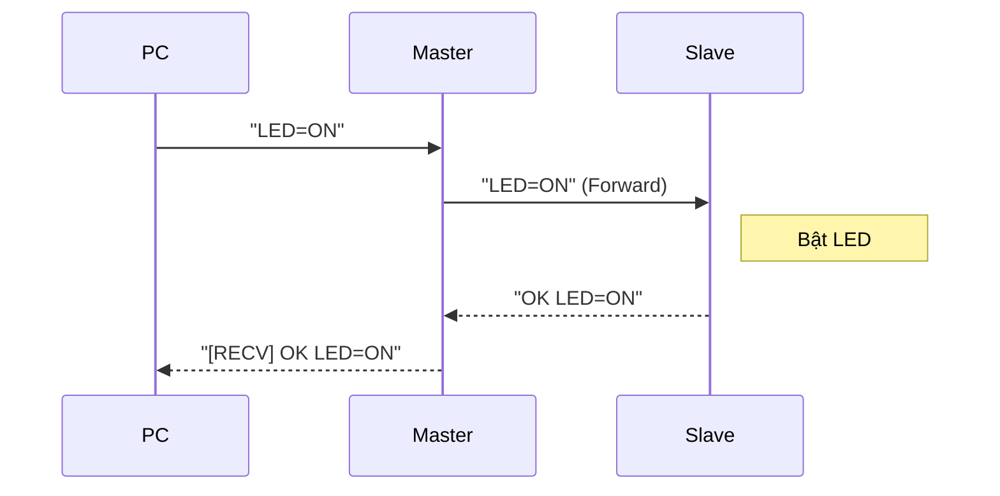

# Tuần 7: Giao thức Kết nối Nối tiếp (Serial UART)

> **Thời lượng**: 3 tiết lý thuyết + 2 tiết thực hành  
> **Mục tiêu**: Giao tiếp UART giữa Arduino và PC, Arduino với Arduino

---

## 🎯 Mục tiêu học tập

Sau khi hoàn thành tuần này, bạn sẽ:

1. ✅ Hiểu giao thức UART và khái niệm baudrate
2. ✅ Gửi dữ liệu từ Arduino lên PC qua Serial Monitor
3. ✅ Nhận lệnh từ PC điều khiển Arduino
4. ✅ Thiết kế giao thức lệnh đơn giản
5. ✅ Giao tiếp UART giữa 2 Arduino

---

## 📚 Phần 1: Lý thuyết cốt lõi

### 1.1 UART là gì?

**UART (Universal Asynchronous Receiver/Transmitter)** là giao thức truyền thông nối tiếp **không đồng bộ**.

```
Arduino              PC/Arduino khác
   TX ─────────────────── RX
   RX ─────────────────── TX
   GND ────────────────── GND
```

#### Đặc điểm UART:
| Đặc điểm | Mô tả |
|----------|-------|
| Không đồng bộ | Không cần chân clock |
| Full-duplex | Gửi và nhận đồng thời |
| Baudrate | Phải giống nhau giữa 2 bên |
| Point-to-point | Chỉ 2 thiết bị trên 1 bus |

### 1.2 Cấu trúc Frame UART

```
   Start    Data bits (8)    Parity   Stop
    ┌─┬─┬─┬─┬─┬─┬─┬─┬─┬─┬─┬─┐
────┤0│D0│D1│D2│D3│D4│D5│D6│D7│P│1│1├────
    └─┴─┴─┴─┴─┴─┴─┴─┴─┴─┴─┴─┘
```

- **Start bit**: 1 bit LOW (0)
- **Data bits**: Thường 8 bit
- **Parity bit**: Tùy chọn (kiểm tra lỗi)
- **Stop bits**: 1 hoặc 2 bit HIGH (1)

### 1.3 Baudrate

**Baudrate** = số bit truyền mỗi giây.

| Baudrate | Thời gian/bit | Ứng dụng |
|----------|---------------|----------|
| 9600 | 104 µs | Phổ biến, debug |
| 38400 | 26 µs | Trung bình |
| 115200 | 8.7 µs | Nhanh, GPS, Bluetooth |

```cpp
Serial.begin(9600);  // Khởi tạo UART ở 9600 baud
```

> ⚠️ **Quan trọng**: Cả 2 bên PHẢI dùng cùng baudrate!

### 1.4 Các hàm Serial Arduino

#### Gửi dữ liệu:
```cpp
Serial.print("Hello");       // Gửi text, không xuống dòng
Serial.println("World");     // Gửi text + xuống dòng
Serial.print(123);           // Gửi số (dạng text)
Serial.print(3.14, 2);       // Float với 2 chữ số thập phân
Serial.write(65);            // Gửi byte raw (ASCII 'A')
```

#### Nhận dữ liệu:
```cpp
if (Serial.available() > 0) {
    char c = Serial.read();           // Đọc 1 byte
    String s = Serial.readString();   // Đọc string (chờ timeout)
    String s = Serial.readStringUntil('\n');  // Đọc đến ký tự newline
    int n = Serial.parseInt();        // Đọc số nguyên
    float f = Serial.parseFloat();    // Đọc số thực
}
```

### 1.5 Hardware Serial vs SoftwareSerial

**Arduino Uno** chỉ có **1 cổng Hardware UART** (Serial - D0/D1). Để giao tiếp với nhiều thiết bị, ta dùng thư viện **SoftwareSerial** (giả lập UART bằng phần mềm, tốn tài nguyên CPU).

> [!NOTE]
> **ESP32** có tới **3 cổng Hardware UART** (Serial, Serial1, Serial2).
> - Bạn có thể map Serial1/Serial2 sang bất kỳ chân GPIO nào.
> - **Khuyên dùng**: Luôn ưu tiên HardwareSerial trên ESP32 thay vì SoftwareSerial.

```cpp
#include <SoftwareSerial.h>

// Tạo cổng UART mềm trên D10 (RX) và D11 (TX)
SoftwareSerial mySerial(10, 11);  // RX, TX

void setup() {
    Serial.begin(9600);     // Hardware UART để debug
    mySerial.begin(9600);   // Software UART để giao tiếp
}
```

> 💡 **Lưu ý**: SoftwareSerial có tốc độ giới hạn (~57600 baud) và không thể nhận/gửi đồng thời nhiều cổng.

---

## 💻 Phần 2: Code mẫu hoàn chỉnh

### 2.1 Đọc pot và gửi telemetry

```cpp
/*
 * Bài 7.1: Đọc pot và hiển thị kết quả trên máy tính
 * 
 * Format: raw,voltage,percent
 * Ví dụ: 512,2.50,50.0
 */

const int POT_PIN = A0;

void setup() {
    Serial.begin(9600);
    Serial.println("=== Pot Telemetry ===");
    Serial.println("Format: raw,voltage,percent");
    Serial.println("------------------------");
}

void loop() {
    int raw = analogRead(POT_PIN);
    float voltage = raw * 5.0 / 1023.0;
    float percent = raw * 100.0 / 1023.0;
    
    // Format CSV: raw,voltage,percent
    Serial.print(raw);
    Serial.print(",");
    Serial.print(voltage, 2);  // 2 decimal places
    Serial.print(",");
    Serial.println(percent, 1);  // 1 decimal place
    
    delay(500);
}
```

### 2.2 Điều khiển LED từ PC

```cpp
/*
 * Bài 7.2: Gửi dữ liệu từ PC điều khiển Arduino
 * 
 * Giao thức lệnh:
 * - LED1=ON / LED1=OFF: Bật/tắt LED 1
 * - LED2=ON / LED2=OFF: Bật/tắt LED 2
 * - PWM=0..255: Điều khiển độ sáng LED PWM
 * - STATUS: Trả về trạng thái hiện tại
 * 
 * Response: OK hoặc ERR + message
 */

const int LED1_PIN = 13;
const int LED2_PIN = 12;
const int LED_PWM_PIN = 9;

bool led1State = false;
bool led2State = false;
int pwmValue = 0;

void setup() {
    Serial.begin(9600);
    pinMode(LED1_PIN, OUTPUT);
    pinMode(LED2_PIN, OUTPUT);
    pinMode(LED_PWM_PIN, OUTPUT);
    
    Serial.println("=== Serial LED Control ===");
    Serial.println("Commands:");
    Serial.println("  LED1=ON / LED1=OFF");
    Serial.println("  LED2=ON / LED2=OFF");
    Serial.println("  PWM=0..255");
    Serial.println("  STATUS");
    Serial.println("==========================");
}

void printStatus() {
    Serial.print("LED1=");
    Serial.print(led1State ? "ON" : "OFF");
    Serial.print(", LED2=");
    Serial.print(led2State ? "ON" : "OFF");
    Serial.print(", PWM=");
    Serial.println(pwmValue);
}

void loop() {
    if (Serial.available() > 0) {
        String command = Serial.readStringUntil('\n');
        command.trim();
        command.toUpperCase();
        
        if (command == "LED1=ON") {
            led1State = true;
            digitalWrite(LED1_PIN, HIGH);
            Serial.println("OK LED1 ON");
        } 
        else if (command == "LED1=OFF") {
            led1State = false;
            digitalWrite(LED1_PIN, LOW);
            Serial.println("OK LED1 OFF");
        }
        else if (command == "LED2=ON") {
            led2State = true;
            digitalWrite(LED2_PIN, HIGH);
            Serial.println("OK LED2 ON");
        }
        else if (command == "LED2=OFF") {
            led2State = false;
            digitalWrite(LED2_PIN, LOW);
            Serial.println("OK LED2 OFF");
        }
        else if (command.startsWith("PWM=")) {
            int value = command.substring(4).toInt();
            if (value >= 0 && value <= 255) {
                pwmValue = value;
                analogWrite(LED_PWM_PIN, value);
                Serial.print("OK PWM=");
                Serial.println(value);
            } else {
                Serial.println("ERR PWM must be 0-255");
            }
        }
        else if (command == "STATUS") {
            printStatus();
        }
        else {
            Serial.print("ERR Unknown command: ");
            Serial.println(command);
        }
    }
}
```

### 2.3 Giao tiếp 2 Arduino (Master-Slave)

**Master Arduino:**
```cpp
/*
 * - Master D11 (TX) <-> Slave D10 (RX)
 * - GND chung
 */



#include <SoftwareSerial.h>

SoftwareSerial slaveSerial(10, 11);  // RX, TX

void setup() {
    Serial.begin(9600);      // PC
    slaveSerial.begin(9600); // Slave
    
    Serial.println("=== MASTER Ready ===");
    Serial.println("Type commands to send to Slave:");
    Serial.println("  LED=ON / LED=OFF");
}

void loop() {
    // Nhận lệnh từ PC, chuyển tiếp đến Slave
    if (Serial.available()) {
        String cmd = Serial.readStringUntil('\n');
        slaveSerial.println(cmd);
        Serial.print("[SENT] ");
        Serial.println(cmd);
    }
    
    // Nhận phản hồi từ Slave, hiện lên PC
    if (slaveSerial.available()) {
        String response = slaveSerial.readStringUntil('\n');
        Serial.print("[RECV] ");
        Serial.println(response);
    }
}
```

**Slave Arduino:**
```cpp
/*
 * Bài 7.3b: Arduino Slave
 * Nhận lệnh từ Master, thực hiện và phản hồi
 */

#include <SoftwareSerial.h>

SoftwareSerial masterSerial(10, 11);  // RX, TX

const int LED_PIN = 13;
bool ledState = false;

void setup() {
    masterSerial.begin(9600);
    pinMode(LED_PIN, OUTPUT);
    digitalWrite(LED_PIN, LOW);
    
    // Gửi ready signal
    masterSerial.println("SLAVE READY");
}

void loop() {
    if (masterSerial.available()) {
        String cmd = masterSerial.readStringUntil('\n');
        cmd.trim();
        
        if (cmd == "LED=ON") {
            ledState = true;
            digitalWrite(LED_PIN, HIGH);
            masterSerial.println("OK LED=ON");
        } 
        else if (cmd == "LED=OFF") {
            ledState = false;
            digitalWrite(LED_PIN, LOW);
            masterSerial.println("OK LED=OFF");
        }
        else if (cmd == "STATUS") {
            masterSerial.print("LED=");
            masterSerial.println(ledState ? "ON" : "OFF");
        }
        else {
            masterSerial.print("ERR ");
            masterSerial.println(cmd);
        }
    }
}
```

---

## ⚠️ Phần 3: Lỗi thường gặp & Cách khắc phục

### 3.1 Bảng lỗi nhanh

| Lỗi | Nguyên nhân | Cách sửa |
|-----|-------------|----------|
| Ký tự lạ (□▫▪) | Sai baudrate | Đặt giống nhau cả 2 bên |
| Không nhận data | TX-RX đấu ngược | TX→RX, RX→TX, GND chung |
| String bị cắt | Buffer timeout | Dùng `readStringUntil('\n')` |
| Mất ký tự đầu | Buffer chưa ready | Thêm delay(100) sau Serial.begin() |

### 3.2 Checklist debug Serial

1. ✅ Baudrate giống nhau? (9600 phổ biến)
2. ✅ TX nối RX và ngược lại?
3. ✅ GND chung giữa 2 board?
4. ✅ Serial Monitor đúng port?
5. ✅ Có `Serial.begin()` trong setup()?
6. ✅ Line ending trong Serial Monitor là "Newline"?

---

## 🎓 Phần 4: Tóm tắt kiến thức

### Key Points:

1. **UART**: Truyền nối tiếp không đồng bộ qua TX/RX
2. **Baudrate**: Tốc độ truyền, phải giống nhau giữa 2 bên
3. **Serial.print()**: Gửi dữ liệu
4. **Serial.read()**: Nhận từng byte
5. **Serial.readStringUntil()**: Nhận string đến ký tự kết thúc
6. **SoftwareSerial**: Tạo thêm cổng UART trên pin bất kỳ

### Thuật ngữ quan trọng:

| Thuật ngữ | Ý nghĩa |
|-----------|---------|
| UART | Universal Asynchronous Receiver/Transmitter |
| Baudrate | Tốc độ truyền (bit/s) |
| TX | Transmit (gửi) |
| RX | Receive (nhận) |
| Full-duplex | Gửi và nhận đồng thời |
| Buffer | Bộ nhớ đệm tạm |

---

## 📋 Phần 5: Quiz tự kiểm tra

### Câu 1:
UART là viết tắt của gì?

- A. Universal Analog Receiver/Transmitter
- B. Universal Asynchronous Receiver/Transmitter
- C. Unified Asynchronous Receiver/Transmitter
- D. Universal Automatic Receiver/Transmitter

<details>
<summary>Đáp án</summary>

**B. Universal Asynchronous Receiver/Transmitter**

UART là giao thức truyền không đồng bộ (Asynchronous) phổ biến.
</details>

### Câu 2:
Nếu baudrate của 2 bên khác nhau, điều gì xảy ra?

- A. Truyền chậm hơn
- B. Nhận được ký tự lạ/sai
- C. Arduino reset
- D. Không có gì

<details>
<summary>Đáp án</summary>

**B. Nhận được ký tự lạ/sai**

Khi baudrate khác nhau, timing bit bị lệch, dẫn đến giải mã sai.
</details>

### Câu 3:
`Serial.available()` trả về gì?

- A. True/False
- B. Số byte trong buffer đang chờ đọc
- C. Baudrate hiện tại
- D. Trạng thái kết nối

<details>
<summary>Đáp án</summary>

**B. Số byte trong buffer đang chờ đọc**

Dùng để kiểm tra có data mới không: `if (Serial.available() > 0)`.
</details>

### Câu 4:
Để giao tiếp 2 Arduino, chân nào nối với chân nào?

- A. TX-TX, RX-RX
- B. TX-RX, RX-TX
- C. TX-GND, RX-VCC
- D. Chỉ cần nối TX

<details>
<summary>Đáp án</summary>

**B. TX-RX, RX-TX**

TX (transmit) của một bên nối với RX (receive) của bên kia, và ngược lại.
</details>

### Câu 5:
`Serial.readStringUntil('\n')` dừng khi nào?

- A. Sau 1 giây
- B. Khi gặp ký tự newline (\n)
- C. Khi buffer đầy
- D. Khi nhận được 64 byte

<details>
<summary>Đáp án</summary>

**B. Khi gặp ký tự newline (\n)**

Đọc string cho đến khi gặp ký tự được chỉ định (newline trong trường hợp này).
</details>

### Câu 6:
SoftwareSerial dùng để làm gì?

- A. Tăng tốc độ Serial
- B. Tạo thêm cổng UART trên pin bất kỳ
- C. Mã hóa dữ liệu
- D. Debug lỗi

<details>
<summary>Đáp án</summary>

**B. Tạo thêm cổng UART trên pin bất kỳ**

Arduino Uno chỉ có 1 hardware UART. SoftwareSerial cho phép tạo thêm.
</details>

### Câu 7:
Hàm nào gửi data MÀ KHÔNG xuống dòng?

- A. Serial.println()
- B. Serial.print()
- C. Serial.write()
- D. Cả B và C

<details>
<summary>Đáp án</summary>

**D. Cả B và C**

`print()` và `write()` đều không tự thêm newline. `println()` có thêm.
</details>

### Câu 8:
Baudrate 9600 có nghĩa là?

- A. 9600 byte mỗi giây
- B. 9600 bit mỗi giây
- C. 9600 ký tự mỗi giây
- D. 9600 frame mỗi giây

<details>
<summary>Đáp án</summary>

**B. 9600 bit mỗi giây**

Với 10 bit/byte (1 start + 8 data + 1 stop), tốc độ thực ≈ 960 byte/s.
</details>

### Câu 9:
Arduino Uno có bao nhiêu cổng Hardware UART?

- A. 0
- B. 1
- C. 2
- D. 4

<details>
<summary>Đáp án</summary>

**B. 1**

Uno có 1 UART trên D0/D1 (cũng dùng cho USB). Mega có 4 UART.
</details>

### Câu 10:
Để đọc số nguyên từ Serial, dùng hàm nào?

- A. Serial.readInt()
- B. Serial.parseInt()
- C. Serial.getNumber()
- D. Serial.readNumber()

<details>
<summary>Đáp án</summary>

**B. Serial.parseInt()**

Đọc chuỗi số và chuyển thành integer.
</details>

---

## 🔬 Phần 6: Bài thực hành (Labs)

### Lab 7-1: Đọc pot và hiển thị trên PC

**Mục tiêu**: Gửi telemetry từ Arduino lên PC

**Yêu cầu**:
- Đọc pot mỗi 500ms
- Gửi dạng CSV: raw,voltage,percent
- Voltage có 2 số thập phân, percent có 1 số

**Rubric**:
| Tiêu chí | Điểm |
|----------|------|
| Format CSV đúng | 40% |
| Giá trị tính toán chính xác | 30% |
| Timing 500ms | 20% |
| Code có comment | 10% |

---

### Lab 7-2: Điều khiển LED từ PC

**Mục tiêu**: Nhận lệnh từ Serial Monitor điều khiển LED

**Yêu cầu**:
- Lệnh: LED1=ON, LED1=OFF, PWM=0..255
- Response: OK hoặc ERR + message
- Có lệnh STATUS trả về trạng thái

**Rubric**:
| Tiêu chí | Điểm |
|----------|------|
| Parse lệnh đúng | 35% |
| LED hoạt động theo lệnh | 25% |
| Response đúng format | 20% |
| PWM hoạt động | 10% |
| Xử lý lỗi (lệnh sai) | 10% |

---

### Lab 7-3: Giao tiếp 2 Arduino

**Mục tiêu**: Master gửi lệnh, Slave thực hiện và phản hồi

**Yêu cầu**:
- Dùng SoftwareSerial
- Master nhận từ PC, chuyển tiếp đến Slave
- Slave thực hiện và phản hồi

**Rubric**:
| Tiêu chí | Điểm |
|----------|------|
| SoftwareSerial hoạt động | 30% |
| Master chuyển tiếp đúng | 25% |
| Slave thực hiện lệnh | 25% |
| Phản hồi về Master→PC | 10% |
| Kết nối TX-RX đúng | 10% |

---

## 🏆 Đề thi mẫu 60 phút

### Đề bài:
Viết chương trình **điều khiển 2 LED từ Serial** và **gửi telemetry pot**:

1. **Lệnh điều khiển**:
   - `LED1=ON` / `LED1=OFF`
   - `LED2=ON` / `LED2=OFF`
   - `ALL=ON` / `ALL=OFF` (bật/tắt cả 2)

2. **Telemetry**: Tự động gửi pot mỗi 1 giây
   - Format: `POT,raw,percent`
   - Ví dụ: `POT,512,50`

3. **Response**: `OK` hoặc `ERR`

### Rubric chấm điểm:

| Tiêu chí | Điểm |
|----------|------|
| Lệnh LED1/LED2 hoạt động | 25% |
| Lệnh ALL hoạt động | 15% |
| Telemetry đúng format và timing | 25% |
| Response OK/ERR đúng | 15% |
| Xử lý lệnh sai | 10% |
| Code sạch, có comment | 10% |

### Code tham khảo:

```cpp
/*
 * Đề thi mẫu: Serial LED Control + Pot Telemetry
 */

const int LED1_PIN = 13;
const int LED2_PIN = 12;
const int POT_PIN = A0;

bool led1 = false, led2 = false;
unsigned long lastTelemetry = 0;

void setup() {
    Serial.begin(9600);
    pinMode(LED1_PIN, OUTPUT);
    pinMode(LED2_PIN, OUTPUT);
    Serial.println("=== Ready ===");
}

void updateLEDs() {
    digitalWrite(LED1_PIN, led1);
    digitalWrite(LED2_PIN, led2);
}

void loop() {
    // Telemetry every 1 second
    if (millis() - lastTelemetry >= 1000) {
        lastTelemetry = millis();
        int raw = analogRead(POT_PIN);
        int percent = map(raw, 0, 1023, 0, 100);
        Serial.print("POT,");
        Serial.print(raw);
        Serial.print(",");
        Serial.println(percent);
    }
    
    // Command handling
    if (Serial.available()) {
        String cmd = Serial.readStringUntil('\n');
        cmd.trim();
        cmd.toUpperCase();
        
        if (cmd == "LED1=ON") { led1 = true; Serial.println("OK"); }
        else if (cmd == "LED1=OFF") { led1 = false; Serial.println("OK"); }
        else if (cmd == "LED2=ON") { led2 = true; Serial.println("OK"); }
        else if (cmd == "LED2=OFF") { led2 = false; Serial.println("OK"); }
        else if (cmd == "ALL=ON") { led1 = led2 = true; Serial.println("OK"); }
        else if (cmd == "ALL=OFF") { led1 = led2 = false; Serial.println("OK"); }
        else { Serial.println("ERR"); }
        
        updateLEDs();
    }
}
```

---

> **Tuần tiếp theo**: Tuần 8 - Giao thức I2C
