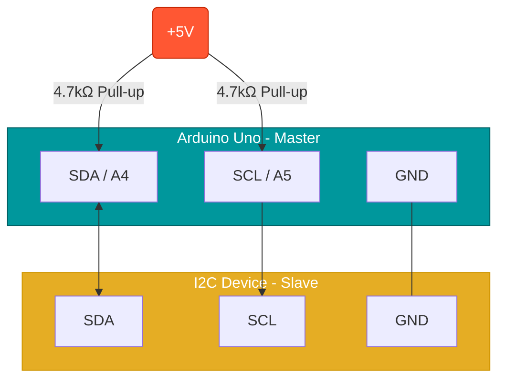

# Tuần 8: Giao thức Kết nối I2C

> **Thời lượng**: 3 tiết lý thuyết + 2 tiết thực hành  
> **Mục tiêu**: Sử dụng I2C để giao tiếp với LCD và các thiết bị khác

---

## 🎯 Mục tiêu học tập

Sau khi hoàn thành tuần này, bạn sẽ:

1. ✅ Hiểu giao thức I2C: SDA, SCL, địa chỉ slave
2. ✅ Quét và phát hiện địa chỉ thiết bị I2C
3. ✅ Hiển thị nội dung lên LCD1602 qua I2C
4. ✅ Giao tiếp I2C Master-Slave giữa 2 Arduino

---

## 📚 Phần 1: Lý thuyết dân dã (Dễ hiểu nhất)

### 1.1 I2C = "Lớp học có 1 giáo viên và nhiều học sinh"

Nếu UART là cuộc điện thoại 1-1, thì **I2C** là một lớp học.
- **Master (Arduino)**: Giáo viên.
- **Slave (Cảm biến, Màn hình)**: Học sinh.
- **Dây SDA (Data)**: Tiếng nói của giáo viên/học sinh.
- **Dây SCL (Clock)**: Tiếng nhịp thước kẻ gõ xuống bàn (Cạch... cạch... cạch...).

Giáo viên muốn gọi ai thì gọi tên người đó (Địa chỉ).
- "Trò Màn Hình!" -> Màn hình: "Dạ có em".
- "Hiển thị chữ Hello!" -> Màn hình làm theo.
- Các trò khác (Cảm biến nhiệt độ, La bàn...) thấy không phải tên mình thì im lặng.

👉 **Ưu điểm**: Chỉ cần **2 dây** (SDA, SCL) mà nối được cả trăm thiết bị.

### 1.2 Địa chỉ "Nhà riêng"

Mỗi thiết bị I2C khi xuất xưởng đều được dán sẵn một con số gọi là **Địa chỉ (Address)**.
- Màn hình LCD thường ở nhà số `0x27`.
- Cảm biến MPU6050 ở nhà số `0x68`.

Trước khi code, phải biết "nhà nó ở đâu". Dùng code **I2C Scanner** để đi gõ cửa từng nhà xem ai trả lời.

### 1.3 Màn hình I2C (LCD 1602) - "Bảng đen điện tử"

Ngày xưa nối màn hình LCD cần tới 16 dây -> Hết sạch chân Arduino.
Người ta gắn thêm 1 con chip thông minh (bộ chuyển đổi I2C) vào sau lưng màn hình.
-> Bây giờ chỉ cần **4 dây**:
1.  **VCC**: Ăn (5V).
2.  **GND**: Uống (Đất).
3.  **SDA**: Nghe (Dữ liệu).
4.  **SCL**: Nhịp (Đồng hồ).

### 1.4 Pull-up Resistor (Cái lò xo kéo lên)

Dây I2C giống như cái chuông dây ngày xưa. Để giật chuông, cần một cái lò xo kéo dây lên cao.
- Nếu không có **điện trở kéo lên (Pull-up)**, dây tín hiệu sẽ bị chùng (nhiễu), không ai nghe thấy gì.
- May mắn là: Hầu hết các module bán sẵn (như màn hình LCD) đã gắn sẵn cái "lò xo" này rồi. Bạn chỉ việc cắm là chạy.

### 1.1 I2C là gì?

**I2C (Inter-Integrated Circuit)** là giao thức truyền thông **đồng bộ** 2 dây, phát minh bởi Philips.



> [!TIP]
> **Điện trở Pull-up**: Rất quan trọng! Nếu module I2C (như màn hình LCD) đã tích hợp sẵn điện trở này thì bạn không cần mắc thêm. Nếu dùng chip trần (như DS1307 rời), bắt buộc phải có.


### 1.2 Đặc điểm I2C

| Đặc điểm | Mô tả |
|----------|-------|
| Số dây | 2 (SDA - Data, SCL - Clock) |
| Đồng bộ | Có clock chung (SCL) |
| Multi-device | Nhiều slave trên 1 bus |
| Địa chỉ | Mỗi slave có địa chỉ 7-bit duy nhất |
| Tốc độ | Standard 100kHz, Fast 400kHz |

### 1.3 So sánh I2C vs UART vs SPI

| Đặc điểm | I2C | UART | SPI |
|----------|-----|------|-----|
| Số dây | 2 | 2 | 4 |
| Đồng bộ | Có | Không | Có |
| Multi-device | Có | Không | Có (cần thêm SS) |
| Tốc độ | Trung bình | Thấp | Cao |
| Độ phức tạp | Trung bình | Đơn giản | Đơn giản-phức tạp |

### 1.4 Địa chỉ I2C thường gặp

| Thiết bị | Địa chỉ |
|----------|---------|
| LCD1602 I2C (PCF8574) | 0x27 hoặc 0x3F |
| OLED SSD1306 | 0x3C hoặc 0x3D |
| BMP180/BMP280 | 0x76 hoặc 0x77 |
| MPU6050 | 0x68 hoặc 0x69 |
| DS3231 RTC | 0x68 |

### 1.5 Arduino Uno I2C Pins

| Chân | Chức năng |
|------|-----------|
| A4 | SDA (Data) |
| A5 | SCL (Clock) |

> 💡 **Lưu ý**: Cần điện trở pull-up 4.7kΩ từ SDA và SCL lên VCC. Nhiều module I2C đã có sẵn.

---

## 🔌 Chuẩn bị phần cứng (Hardware Setup)

**1. Màn hình LCD 1602 (Kèm module I2C sau lưng):**
Chỉ cần 4 dây nối vào Arduino Uno:
```
[GND] ────── [GND]
[VCC] ────── [5V]
[SDA] ────── [Pin A4] (hoặc SDA)
[SCL] ────── [Pin A5] (hoặc SCL)
```
*(Nếu màn hình không hiện chữ, hãy lấy tua-vít vặn nhẹ biến trở xanh dương phía sau module I2C để chỉnh độ tương phản LCD).*

---

## 🧱 Phần 2: Bài tập khởi động (Warm-up)

### 2.1 Drill 1: Điểm danh (I2C Scanner Mini)
**Mục tiêu**: Tìm xem cái màn hình LCD đang trốn ở địa chỉ nào (thường là 0x27 hoặc 0x3F).

```cpp
#include <Wire.h>

void setup() {
    Wire.begin();
    Serial.begin(9600);
}

void loop() {
    Serial.println("Dang quet...");
    for (byte i = 1; i < 127; i++) {
        Wire.beginTransmission(i);
        if (Wire.endTransmission() == 0) {
            Serial.print("Thay thiet bi tai: 0x");
            Serial.println(i, HEX);
        }
    }
    delay(3000);
}
```

### 2.2 Drill 2: Xin chào (Hello LCD)
**Mục tiêu**: Hiện chữ lên màn hình. (Nhớ thay 0x27 bằng địa chỉ tìm được ở trên).

```cpp
#include <LiquidCrystal_I2C.h>
LiquidCrystal_I2C lcd(0x27, 16, 2);

void setup() {
    lcd.init();
    lcd.backlight();
    lcd.print("Chao ban!");
    lcd.setCursor(0, 1); // Xuống dòng
    lcd.print("Arduino de ot");
}

void loop() {}
```

---

## 💻 Phần 3: Code mẫu hoàn chỉnh

### 2.1 I2C Scanner - Quét địa chỉ

```cpp
/*
 * Bài 8-1: Quét và xác định địa chỉ thiết bị I2C
 * 
 * Kết quả: In ra tất cả địa chỉ thiết bị tìm thấy
 */

#include <Wire.h>

void setup() {
    Wire.begin();  // Khởi tạo I2C (Master mode)
    Serial.begin(9600);
    
    Serial.println("=== I2C Scanner ===");
    Serial.println("Scanning...\n");
}

void loop() {
    int deviceCount = 0;
    
    for (byte address = 1; address < 127; address++) {
        Wire.beginTransmission(address);
        byte error = Wire.endTransmission();
        
        if (error == 0) {
            Serial.print("Device found at address 0x");
            if (address < 16) Serial.print("0");
            Serial.print(address, HEX);
            
            // Nhận dạng thiết bị phổ biến
            if (address == 0x27 || address == 0x3F) {
                Serial.print(" (LCD1602 I2C)");
            } else if (address == 0x3C || address == 0x3D) {
                Serial.print(" (OLED SSD1306)");
            } else if (address == 0x68) {
                Serial.print(" (MPU6050 / DS3231)");
            } else if (address == 0x76 || address == 0x77) {
                Serial.print(" (BMP180/280)");
            }
            Serial.println();
            deviceCount++;
        }
    }
    
    Serial.println();
    if (deviceCount == 0) {
        Serial.println("No I2C devices found!");
        Serial.println("Check wiring: SDA=A4, SCL=A5");
    } else {
        Serial.print("Found ");
        Serial.print(deviceCount);
        Serial.println(" device(s)\n");
    }
    
    delay(5000);  // Quét lại sau 5 giây
}
```

### 2.2 LCD1602 I2C - Hiển thị cơ bản

```cpp
/*
 * Bài 8-2: Hiển thị nội dung trên LCD1602 I2C
 * 
 * Thư viện: LiquidCrystal_I2C
 * Cài: Sketch > Include Library > Manage Libraries > "LiquidCrystal I2C"
 */

#include <Wire.h>
#include <LiquidCrystal_I2C.h>

// Địa chỉ thường là 0x27 hoặc 0x3F (chạy I2C Scanner để xác định)
LiquidCrystal_I2C lcd(0x27, 16, 2);  // Địa chỉ, số cột, số hàng

void setup() {
    lcd.init();       // Khởi tạo LCD
    lcd.backlight();  // Bật đèn nền
    
    lcd.setCursor(0, 0);  // Cột 0, hàng 0
    lcd.print("Hello Arduino!");
    
    lcd.setCursor(0, 1);  // Cột 0, hàng 1
    lcd.print("I2C LCD Demo");
}

void loop() {
    // Đếm giây
    static unsigned long lastUpdate = 0;
    static int seconds = 0;
    
    if (millis() - lastUpdate >= 1000) {
        lastUpdate = millis();
        seconds++;
        
        lcd.setCursor(14, 1);  // Góc phải hàng 2
        if (seconds < 10) lcd.print("0");
        lcd.print(seconds % 60);
    }
}
```

### 2.3 LCD hiển thị sensor với nút đổi mode

```cpp
/*
 * Bài 8-2b: LCD hiển thị pot với nút đổi mode
 * 
 * Mode 1: Hiển thị phần trăm
 * Mode 2: Hiển thị giá trị raw
 * Mode 3: Hiển thị điện áp
 */

#include <Wire.h>
#include <LiquidCrystal_I2C.h>

LiquidCrystal_I2C lcd(0x27, 16, 2);

const int POT_PIN = A0;
const int BUTTON_PIN = 2;

int mode = 1;  // 1=Percent, 2=Raw, 3=Voltage

bool lastButtonState = HIGH;
unsigned long lastDebounce = 0;

void setup() {
    lcd.init();
    lcd.backlight();
    pinMode(BUTTON_PIN, INPUT_PULLUP);
    
    Serial.begin(9600);
    updateModeDisplay();
}

void updateModeDisplay() {
    lcd.setCursor(0, 0);
    lcd.print("Mode: ");
    switch (mode) {
        case 1: lcd.print("Percent   "); break;
        case 2: lcd.print("Raw       "); break;
        case 3: lcd.print("Voltage   "); break;
    }
}

void loop() {
    // Đọc nút đổi mode
    bool buttonState = digitalRead(BUTTON_PIN);
    if (buttonState != lastButtonState) {
        lastDebounce = millis();
    }
    if ((millis() - lastDebounce) > 50) {
        static bool stableState = HIGH;
        if (buttonState != stableState) {
            stableState = buttonState;
            if (stableState == LOW) {
                mode = (mode % 3) + 1;  // Xoay vòng 1→2→3→1
                updateModeDisplay();
                Serial.print("Mode changed to: ");
                Serial.println(mode);
            }
        }
    }
    lastButtonState = buttonState;
    
    // Đọc pot và hiển thị
    int raw = analogRead(POT_PIN);
    float voltage = raw * 5.0 / 1023.0;
    int percent = map(raw, 0, 1023, 0, 100);
    
    lcd.setCursor(0, 1);
    lcd.print("Value: ");
    
    switch (mode) {
        case 1:
            lcd.print(percent);
            lcd.print("%      ");
            break;
        case 2:
            lcd.print(raw);
            lcd.print("      ");
            break;
        case 3:
            lcd.print(voltage, 2);
            lcd.print("V    ");
            break;
    }
    
    delay(100);
}
```

### 2.4 I2C Master-Slave giữa 2 Arduino

**Master:**
```cpp
/*
 * Bài 8-3a: I2C Master
 * Gửi lệnh đến Slave, nhận phản hồi
 */

#include <Wire.h>

const int SLAVE_ADDRESS = 8;

void setup() {
    Wire.begin();  // Master mode (không có địa chỉ)
    Serial.begin(9600);
    
    Serial.println("=== I2C Master ===");
    Serial.println("Commands: LED=ON, LED=OFF, STATUS");
}

void loop() {
    if (Serial.available()) {
        String cmd = Serial.readStringUntil('\n');
        cmd.trim();
        
        // Gửi lệnh đến Slave
        Wire.beginTransmission(SLAVE_ADDRESS);
        Wire.write(cmd.c_str());
        Wire.endTransmission();
        
        Serial.print("[SENT] ");
        Serial.println(cmd);
        
        delay(10);  // Chờ Slave xử lý
        
        // Yêu cầu phản hồi từ Slave
        Wire.requestFrom(SLAVE_ADDRESS, 16);  // Đọc tối đa 16 byte
        String response = "";
        while (Wire.available()) {
            char c = Wire.read();
            if (c != '\0') response += c;
        }
        
        if (response.length() > 0) {
            Serial.print("[RECV] ");
            Serial.println(response);
        }
    }
}
```

**Slave:**
```cpp
/*
 * Bài 8-3b: I2C Slave
 * Nhận lệnh từ Master, thực hiện và chuẩn bị phản hồi
 */

#include <Wire.h>

const int SLAVE_ADDRESS = 8;
const int LED_PIN = 13;

bool ledState = false;
String response = "";

void receiveEvent(int howMany) {
    String cmd = "";
    while (Wire.available()) {
        char c = Wire.read();
        cmd += c;
    }
    cmd.trim();
    
    if (cmd == "LED=ON") {
        ledState = true;
        digitalWrite(LED_PIN, HIGH);
        response = "OK LED=ON";
    } 
    else if (cmd == "LED=OFF") {
        ledState = false;
        digitalWrite(LED_PIN, LOW);
        response = "OK LED=OFF";
    }
    else if (cmd == "STATUS") {
        response = ledState ? "LED=ON" : "LED=OFF";
    }
    else {
        response = "ERR";
    }
}

void requestEvent() {
    Wire.write(response.c_str());
}

void setup() {
    Wire.begin(SLAVE_ADDRESS);  // Slave mode với địa chỉ
    Wire.onReceive(receiveEvent);
    Wire.onRequest(requestEvent);
    
    pinMode(LED_PIN, OUTPUT);
    digitalWrite(LED_PIN, LOW);
}

void loop() {
    // Slave chỉ phản ứng qua interrupt
    delay(100);
}
```

---

## ⚠️ Phần 4: Lỗi thường gặp & Cách khắc phục

| Lỗi | Nguyên nhân | Cách sửa |
|-----|-------------|----------|
| Không tìm thấy device | Sai địa chỉ | Chạy I2C Scanner |
| LCD chỉ hiện ô vuông | Sai contrast | Vặn biến trở trên module I2C |
| "Không giao tiếp được" | Thiếu pull-up | Thêm 4.7kΩ từ SDA/SCL lên VCC |
| LCD không sáng | Chưa gọi backlight() | Thêm `lcd.backlight();` |

### Checklist debug I2C:
1. ✅ Đã nối đúng SDA=A4, SCL=A5?
2. ✅ GND chung giữa các thiết bị?
3. ✅ Chạy I2C Scanner xác định địa chỉ?
4. ✅ Có pull-up resistor? (nhiều module có sẵn)
5. ✅ VCC đúng (3.3V hay 5V)?

---

## 🎓 Phần 5: Tóm tắt kiến thức

### Key Points:

1. **I2C**: 2 dây (SDA, SCL), đồng bộ, multi-slave
2. **Wire.h**: Thư viện I2C của Arduino
3. **Address**: Mỗi slave có địa chỉ 7-bit duy nhất
4. **I2C Scanner**: Công cụ tìm địa chỉ thiết bị
5. **LCD I2C**: Chỉ cần 2 dây data thay vì 6-8 dây

### Thuật ngữ:

| Thuật ngữ | Ý nghĩa |
|-----------|---------|
| SDA | Serial Data |
| SCL | Serial Clock |
| Master | Thiết bị điều khiển bus |
| Slave | Thiết bị phản hồi |
| Pull-up | Điện trở kéo lên VCC |

---

## 📋 Phần 6: Quiz tự kiểm tra

### Câu 1:
I2C cần bao nhiêu dây dữ liệu?

- A. 1
- B. 2
- C. 3
- D. 4

<details>
<summary>Đáp án</summary>

**B. 2**

SDA (Data) và SCL (Clock).
</details>

### Câu 2:
Chân I2C của Arduino Uno là?

- A. D0, D1
- B. D10, D11
- C. A4, A5
- D. D2, D3

<details>
<summary>Đáp án</summary>

**C. A4, A5**

A4 = SDA, A5 = SCL.
</details>

### Câu 3:
Địa chỉ LCD1602 I2C thường là?

- A. 0x08
- B. 0x27 hoặc 0x3F
- C. 0x50
- D. 0x68

<details>
<summary>Đáp án</summary>

**B. 0x27 hoặc 0x3F**

Tùy thuộc vào chip PCF8574 (0x27) hoặc PCF8574A (0x3F).
</details>

### Câu 4:
`Wire.begin()` không có tham số nghĩa là?

- A. Slave mode
- B. Master mode
- C. Lỗi
- D. Tự detect

<details>
<summary>Đáp án</summary>

**B. Master mode**

Không địa chỉ = Master. Có địa chỉ = Slave.
</details>

### Câu 5:
Tại sao I2C cần pull-up resistor?

- A. Tăng tốc độ
- B. Bus I2C là open-drain, cần kéo lên HIGH
- C. Bảo vệ quá áp
- D. Giảm nhiễu

<details>
<summary>Đáp án</summary>

**B. Bus I2C là open-drain, cần kéo lên HIGH**

Thiết bị I2C chỉ có thể kéo xuống LOW, cần resistor kéo lên HIGH.
</details>

### Câu 6-10:
*(Câu hỏi về LCD, Master/Slave, so sánh với UART/SPI)*

---

## 🔬 Phần 6: Bài thực hành (Labs)

### Lab 8-1: I2C Scanner
**Rubric**: Tìm đúng địa chỉ (50%), format output (30%), nhận dạng thiết bị (20%)

### Lab 8-2: LCD hiển thị
**Rubric**: LCD hiện đúng (40%), 2 dòng (30%), đếm giây (20%), code (10%)

### Lab 8-3: Master-Slave
**Rubric**: Gửi lệnh (30%), Slave thực hiện (30%), Phản hồi (30%), code (10%)

---

## 🏆 Đề thi mẫu 60 phút

**LCD hiển thị pot raw/V/% + nút đổi mode + Serial backup log**

| Tiêu chí | Điểm |
|----------|------|
| LCD hiển thị 3 mode | 30% |
| Nút đổi mode (debounce) | 25% |
| Pot đọc đúng | 20% |
| Serial log backup | 15% |
| Code sạch | 10% |

---

> **Tuần tiếp theo**: Tuần 9 - Giao thức SPI
