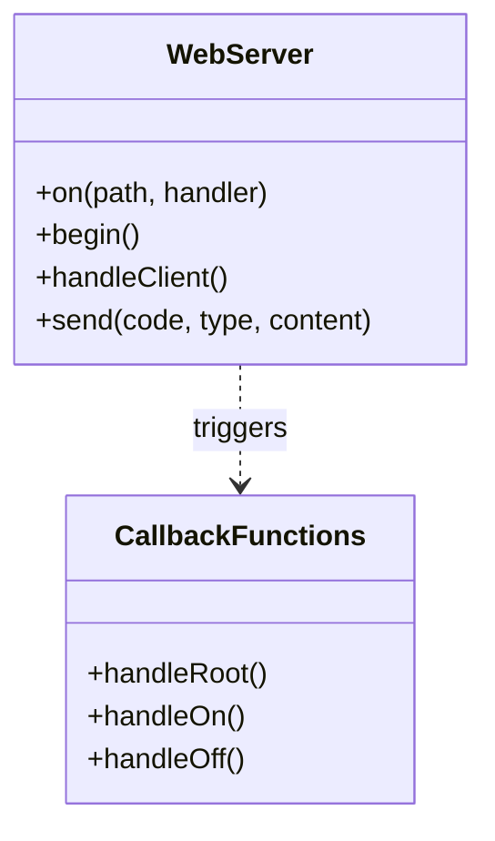

# Tuần 11: Giao tiếp WiFi - Chế độ WebServer

> **Thời lượng**: 3 tiết lý thuyết + 2 tiết thực hành  
> **Mục tiêu**: Điều khiển LED từ xa qua web browser

---

## 🎯 Mục tiêu học tập

Sau khi hoàn thành tuần này, bạn sẽ:

1. ✅ Hiểu WiFi Station vs Access Point mode
2. ✅ Tạo WebServer cơ bản điều khiển LED
3. ✅ Thiết kế giao diện web ON/OFF đẹp mắt
4. ✅ Xử lý HTTP request/response

---

## 📚 Phần 1: Lý thuyết cốt lõi

### 1.1 Lưu ý phần cứng

> ⚠️ **Arduino Uno KHÔNG có WiFi**. Cần dùng **ESP8266** hoặc **ESP32**.

| Board | WiFi | Giá | Phổ biến |
|-------|------|-----|----------|
| ESP8266 (NodeMCU) | Có | Rẻ | Rất phổ biến |
| ESP32 | Có + BLE | Trung bình | Mạnh hơn |
| Arduino Uno + Shield | Cần module | Đắt | Ít dùng |

### 1.2 ESP8266 & ESP32 Pinout

#### ESP8266 NodeMCU:
```
        ┌─────USB─────┐
     D0 │ 16 ●   ● A0 │ ADC
     D1 │  5 ●   ● GND│
     D2 │  4 ●   ● VV │ 3.3V
     D3 │  0 ●   ● S3 │ D8-10
     D4 │  2 ●   ● S2 │ D8-9-10
    3V3 │    ●   ● S1 │ D8-9-10-MISO
    GND │    ●   ● SC │ SCK
     D5 │ 14 ●   ● S0 │ MOSI
     D6 │ 12 ●   ● G  │ GND
     D7 │ 13 ●   ● 3V │ 3.3V
     D8 │ 15 ●   ● EN │
     RX │  3 ●   ● RST│
     TX │  1 ●   ● GND│
        └─────────────┘
```

#### ESP32 DevKit V1:
```
        ┌─────USB─────┐
     EN │ ●         ● │ 23 (MOSI)
     VP │ ●         ● │ 22 (SCL)
     VN │ ●         ● │  1 (TX0)
     34 │ ●         ● │  3 (RX0)
     35 │ ●         ● │ 21 (SDA)
     32 │ ●         ● │ GND
     33 │ ●         ● │ 19 (MISO)
     25 │ ●         ● │ 18 (SCK)
     26 │ ●         ● │  5 (SS)
     27 │ ●         ● │ 17 (TX2)
     14 │ ●         ● │ 16 (RX2)
     12 │ ●         ● │  4
    GND │ ●         ● │  0
     13 │ ●         ● │  2 (LED)
     D2 │ ●         ● │ 15
     D3 │ ●         ● │ D1
CMD(11) │ ●         ● │ D0
    5V  │ ●         ● │ 3.3V
        └─────────────┘
```

### 1.3 WiFi Modes

| Mode | Mô tả |
|------|-------|
| Station (STA) | Kết nối vào WiFi có sẵn |
| Access Point (AP) | Tạo WiFi riêng |
| STA + AP | Cả hai đồng thời |

### 1.4 HTTP Request/Response

```
Browser                     ESP8266
   │                           │
   │ ── GET /led/on ─────────► │  Request
   │                           │  Process: digitalWrite(LED, HIGH)
   │ ◄────── 200 OK ────────── │  Response + HTML
   │                           │
```

#### Cấu trúc xử lý:




---

## 💻 Phần 2: Code mẫu hoàn chỉnh

### 2.1 WebServer điều khiển 1 LED

```cpp
/*
 * Bài 11.1: WebServer bật/tắt 1 LED
 * 
 * Tiêu đề: "Hệ thống bật / tắt Led – WebServer cấu hình cơ bản"
 * 
 * Board: ESP8266 (NodeMCU/Wemos D1)
 */

#include <ESP8266WiFi.h>
#include <ESP8266WebServer.h>

// ========== CẤU HÌNH WIFI ==========
const char* ssid = "TEN_WIFI_CUA_BAN";
const char* password = "MAT_KHAU_WIFI";

// ========== HARDWARE ==========
const int LED_PIN = LED_BUILTIN;  // GPIO2, active LOW
bool ledState = false;

ESP8266WebServer server(80);

// ========== HTML PAGE ==========
String getHTML() {
    String html = R"(
<!DOCTYPE html>
<html>
<head>
    <meta charset='UTF-8'>
    <meta name='viewport' content='width=device-width, initial-scale=1'>
    <title>LED Control</title>
    <style>
        * { box-sizing: border-box; margin: 0; padding: 0; }
        body {
            font-family: 'Segoe UI', Arial, sans-serif;
            background: linear-gradient(135deg, #1a1a2e 0%, #16213e 100%);
            min-height: 100vh;
            display: flex;
            flex-direction: column;
            align-items: center;
            padding: 40px 20px;
            color: #fff;
        }
        h1 {
            color: #00d4ff;
            margin-bottom: 30px;
            text-align: center;
            font-size: 24px;
        }
        .status {
            font-size: 28px;
            margin: 30px 0;
            padding: 20px 40px;
            border-radius: 15px;
            text-transform: uppercase;
            font-weight: bold;
            transition: all 0.3s ease;
        }
        .status-on {
            background: linear-gradient(135deg, #4CAF50, #45a049);
            box-shadow: 0 0 30px rgba(76, 175, 80, 0.5);
        }
        .status-off {
            background: #555;
            box-shadow: 0 0 20px rgba(0, 0, 0, 0.3);
        }
        .btn-container { margin-top: 20px; }
        .btn {
            padding: 18px 50px;
            font-size: 20px;
            margin: 10px;
            border: none;
            border-radius: 12px;
            cursor: pointer;
            text-decoration: none;
            display: inline-block;
            transition: transform 0.2s, box-shadow 0.2s;
            font-weight: bold;
        }
        .btn:hover { transform: scale(1.05); }
        .btn-on {
            background: linear-gradient(135deg, #4CAF50, #45a049);
            color: white;
        }
        .btn-off {
            background: linear-gradient(135deg, #f44336, #da190b);
            color: white;
        }
        .ip-info {
            margin-top: 40px;
            padding: 15px;
            background: rgba(255,255,255,0.1);
            border-radius: 10px;
            font-size: 14px;
        }
    </style>
</head>
<body>
    <h1>Hệ thống bật / tắt Led<br>WebServer cấu hình cơ bản</h1>
    
    <div class='status )";
    
    html += ledState ? "status-on'>LED ĐANG BẬT" : "status-off'>LED ĐANG TẮT";
    html += R"(</div>
    
    <div class='btn-container'>
        <a href='/on' class='btn btn-on'>ON</a>
        <a href='/off' class='btn btn-off'>OFF</a>
    </div>
    
    <div class='ip-info'>
        IP: )";
    html += WiFi.localIP().toString();
    html += R"(
    </div>
</body>
</html>
)";
    return html;
}

// ========== HANDLERS ==========
void handleRoot() {
    server.send(200, "text/html", getHTML());
}

void handleOn() {
    ledState = true;
    digitalWrite(LED_PIN, LOW);  // LED_BUILTIN active LOW
    Serial.println("LED ON");
    server.send(200, "text/html", getHTML());
}

void handleOff() {
    ledState = false;
    digitalWrite(LED_PIN, HIGH);
    Serial.println("LED OFF");
    server.send(200, "text/html", getHTML());
}

// ========== SETUP ==========
void setup() {
    Serial.begin(115200);
    pinMode(LED_PIN, OUTPUT);
    digitalWrite(LED_PIN, HIGH);  // OFF
    
    // Kết nối WiFi
    Serial.println();
    Serial.print("Connecting to ");
    Serial.println(ssid);
    
    WiFi.begin(ssid, password);
    while (WiFi.status() != WL_CONNECTED) {
        delay(500);
        Serial.print(".");
    }
    
    Serial.println();
    Serial.println("WiFi connected!");
    Serial.print("IP address: ");
    Serial.println(WiFi.localIP());
    
    // Setup routes
    server.on("/", handleRoot);
    server.on("/on", handleOn);
    server.on("/off", handleOff);
    
    server.begin();
    Serial.println("HTTP server started!");
    Serial.println("Open browser and go to: http://" + WiFi.localIP().toString());
}

// ========== LOOP ==========
void loop() {
    server.handleClient();
}
```

### 2.2 WebServer điều khiển 2 LED

```cpp
/*
 * Bài 11.2: WebServer bật/tắt 2 LED
 * 
 * Tiêu đề: "Hệ thống bật / tắt 2 Led – WebServer cấu hình cơ bản"
 * Nút hiển thị BAT/TAT đúng trạng thái
 */

#include <ESP8266WiFi.h>
#include <ESP8266WebServer.h>

const char* ssid = "TEN_WIFI";
const char* password = "MAT_KHAU";

const int LED1_PIN = D1;  // GPIO5
const int LED2_PIN = D2;  // GPIO4
bool led1State = false;
bool led2State = false;

ESP8266WebServer server(80);

String getHTML() {
    String html = R"(
<!DOCTYPE html>
<html>
<head>
    <meta charset='UTF-8'>
    <meta name='viewport' content='width=device-width, initial-scale=1'>
    <title>2 LED Control</title>
    <style>
        body {
            font-family: Arial, sans-serif;
            background: linear-gradient(135deg, #0f0f23, #1a1a3e);
            min-height: 100vh;
            display: flex;
            flex-direction: column;
            align-items: center;
            padding: 30px;
            color: #fff;
        }
        h1 { color: #00d4ff; margin-bottom: 30px; text-align: center; }
        .led-box {
            background: rgba(255,255,255,0.05);
            padding: 25px;
            margin: 15px;
            border-radius: 20px;
            width: 280px;
            text-align: center;
        }
        .led-title {
            font-size: 22px;
            margin-bottom: 15px;
            display: flex;
            align-items: center;
            justify-content: center;
        }
        .indicator {
            width: 20px;
            height: 20px;
            border-radius: 50%;
            margin-left: 10px;
        }
        .ind-on { background: #4CAF50; box-shadow: 0 0 15px #4CAF50; }
        .ind-off { background: #555; }
        .btn {
            padding: 15px 40px;
            font-size: 18px;
            border: none;
            border-radius: 10px;
            cursor: pointer;
            text-decoration: none;
            display: inline-block;
            min-width: 100px;
            font-weight: bold;
        }
        .btn-bat { background: #4CAF50; color: white; }
        .btn-tat { background: #f44336; color: white; }
    </style>
</head>
<body>
    <h1>Hệ thống bật / tắt 2 Led<br>WebServer cấu hình cơ bản</h1>
    
    <div class='led-box'>
        <div class='led-title'>
            LED 1 <span class='indicator )";
    html += led1State ? "ind-on" : "ind-off";
    html += R"('></span>
        </div>
        <a href='/led1/toggle' class='btn )";
    html += led1State ? "btn-tat'>TAT" : "btn-bat'>BAT";
    html += R"('></a>
    </div>
    
    <div class='led-box'>
        <div class='led-title'>
            LED 2 <span class='indicator )";
    html += led2State ? "ind-on" : "ind-off";
    html += R"('></span>
        </div>
        <a href='/led2/toggle' class='btn )";
    html += led2State ? "btn-tat'>TAT" : "btn-bat'>BAT";
    html += R"('></a>
    </div>
</body>
</html>
)";
    return html;
}

void handleRoot() {
    server.send(200, "text/html", getHTML());
}

void handleLed1Toggle() {
    led1State = !led1State;
    digitalWrite(LED1_PIN, led1State);
    Serial.print("LED1: ");
    Serial.println(led1State ? "ON" : "OFF");
    server.send(200, "text/html", getHTML());
}

void handleLed2Toggle() {
    led2State = !led2State;
    digitalWrite(LED2_PIN, led2State);
    Serial.print("LED2: ");
    Serial.println(led2State ? "ON" : "OFF");
    server.send(200, "text/html", getHTML());
}

void setup() {
    Serial.begin(115200);
    pinMode(LED1_PIN, OUTPUT);
    pinMode(LED2_PIN, OUTPUT);
    digitalWrite(LED1_PIN, LOW);
    digitalWrite(LED2_PIN, LOW);
    
    WiFi.begin(ssid, password);
    while (WiFi.status() != WL_CONNECTED) {
        delay(500);
        Serial.print(".");
    }
    Serial.println();
    Serial.println(WiFi.localIP());
    
    server.on("/", handleRoot);
    server.on("/led1/toggle", handleLed1Toggle);
    server.on("/led2/toggle", handleLed2Toggle);
    
    server.begin();
}

void loop() {
    server.handleClient();
}
```

---

## ⚠️ Phần 3: Lỗi thường gặp

| Lỗi | Nguyên nhân | Cách sửa |
|-----|-------------|----------|
| Không kết nối WiFi | Sai SSID/password | Kiểm tra và sửa |
| Không truy cập được web | Sai IP | Xem Serial Monitor để lấy IP |
| Trang trắng | HTML lỗi | Kiểm tra cặp tag |
| LED không sáng | Sai chân hoặc logic | Kiểm tra GPIO và active HIGH/LOW |

### Checklist:
1. ✅ Cài board ESP8266/ESP32 trong Arduino IDE?
2. ✅ SSID và password đúng?
3. ✅ Cùng mạng WiFi với máy tính/điện thoại?
4. ✅ Đúng GPIO (D1=GPIO5, D2=GPIO4)?

---

## 🎓 Phần 4: Tóm tắt

1. **ESP8266/ESP32**: Board WiFi thay thế Arduino cho IoT
2. **WebServer**: Lắng nghe HTTP request, trả HTML
3. **Route**: server.on("/path", handler)
4. **handleClient()**: Phải gọi trong loop()

---

## 📋 Phần 5: Quiz (5 câu)

### Câu 1:
Arduino Uno có WiFi tích hợp không?
<details><summary>Đáp án</summary>**Không**. Cần dùng ESP8266/ESP32.</details>

### Câu 2:
`server.on("/on", handleOn)` nghĩa là gì?
<details><summary>Đáp án</summary>Khi truy cập URL `/on`, hàm `handleOn()` sẽ được gọi.</details>

### Câu 3:
Hàm nào phải gọi liên tục trong loop()?
<details><summary>Đáp án</summary>`server.handleClient()`</details>

### Câu 4-5:
*(Câu hỏi về WiFi mode, HTTP method)*

---

## 🔬 Phần 6: Labs + Rubric

### Lab 11-1: 1 LED WebServer
**Rubric**: Web hoạt động (40%), LED đúng (30%), UI đẹp (20%), Serial log (10%)

### Lab 11-2: 2 LED WebServer
**Rubric**: 2 LED độc lập (40%), nút BAT/TAT đúng (30%), UI đẹp (20%), code (10%)

---

## 🏆 Đề thi mẫu 60 phút

**Web điều khiển 2 LED + /state endpoint trả JSON**

| Tiêu chí | Điểm |
|----------|------|
| 2 LED hoạt động | 30% |
| /state trả JSON | 25% |
| Trạng thái không mất khi refresh | 20% |
| UI đẹp | 15% |
| Code sạch | 10% |

---

> **Tuần tiếp theo**: Tuần 12 - Async WebServer
