# Tuần 12: Giao tiếp WiFi - Chế độ Asynchronous WebServer

> **Thời lượng**: 3 tiết lý thuyết + 2 tiết thực hành  
> **Mục tiêu**: Xây dựng WebServer không đồng bộ, responsive và realtime

---

## 🎯 Mục tiêu học tập

Sau khi hoàn thành tuần này, bạn sẽ:

1. ✅ Hiểu sự khác biệt giữa Sync và Async WebServer
2. ✅ Sử dụng ESPAsyncWebServer library
3. ✅ Tạo API endpoint trả JSON cho JavaScript
4. ✅ Xây dựng dashboard IoT với auto-refresh

---

## 📚 Phần 1: Lý thuyết cốt lõi

### 1.1 Sync vs Async WebServer

| Đặc điểm | Sync (ESP8266WebServer) | Async (ESPAsyncWebServer) |
|----------|------------------------|---------------------------|
| Xử lý request | Từng cái một, blocking | Đồng thời, non-blocking |
| handleClient() | Phải gọi trong loop() | KHÔNG cần |
| Performance | Thấp | Cao |
| Nhiều client | Chậm | Nhanh |

```
Client 1 ─► ┌─────────────┐
            │   Async     │ ─► LED Control
Client 2 ─► │  WebServer  │ ─► Send JSON
            │             │ ─► Sensor Read
Client 3 ─► └─────────────┘
                  ↑
          Event-driven (không block)
```

### Sơ đồ tuần tự xử lý Async (Mermaid)

```mermaid
sequenceDiagram
    participant C as Client (Browser)
    participant S as ESP32 (Async Server)
    participant L as LED Hardware
    
    Note over C,S: Non-blocking Request
    C->>S: GET /toggle/1
    S-->>C: Trả về JSON {"status": "ok"} ngay lập tức
    
    par Xử lý phần cứng
        S->>L: Đảo trạng thái LED
    and Cập nhật UI
        C->>C: Đổi màu nút bấm
    end
```



### 1.3 Thư viện cần cài

**ESP8266:**
- ESPAsyncWebServer
- ESPAsyncTCP

**ESP32:**
- ESPAsyncWebServer
- AsyncTCP

### 1.4 JSON API Pattern

```
Browser                     ESP8266
   │                           │
   │ ── fetch('/api/state') ─► │  GET request
   │ ◄─ {"led1":true,"led2": ─ │  JSON response
   │     false}                │
   │                           │
   │ (JavaScript cập nhật UI)  │
```

---

## 💻 Phần 2: Code mẫu hoàn chỉnh

### 2.1 Async WebServer điều khiển 1 LED

```cpp
/*
 * Bài 12.1: Async WebServer bật/tắt 1 LED
 * 
 * Tiêu đề: "Hệ thống bật / tắt Led – WebServer cấu hình không đồng bộ"
 */

#ifdef ESP8266
  #include <ESP8266WiFi.h>
  #include <ESPAsyncTCP.h>
#else
  #include <WiFi.h>
  #include <AsyncTCP.h>
#endif

#include <ESPAsyncWebServer.h>

const char* ssid = "TEN_WIFI";
const char* password = "MAT_KHAU";

const int LED_PIN = LED_BUILTIN;
bool ledState = false;

AsyncWebServer server(80);

// ========== HTML với JavaScript Fetch ==========
const char index_html[] PROGMEM = R"rawliteral(
<!DOCTYPE html>
<html>
<head>
    <meta charset="UTF-8">
    <meta name="viewport" content="width=device-width, initial-scale=1">
    <title>Async LED Control</title>
    <style>
        * { box-sizing: border-box; }
        body {
            font-family: 'Segoe UI', Arial, sans-serif;
            background: linear-gradient(135deg, #1a1a2e, #16213e);
            min-height: 100vh;
            margin: 0;
            padding: 40px 20px;
            display: flex;
            flex-direction: column;
            align-items: center;
            color: #fff;
        }
        h1 {
            color: #00d4ff;
            text-align: center;
            margin-bottom: 30px;
        }
        .status {
            font-size: 32px;
            font-weight: bold;
            padding: 25px 50px;
            border-radius: 20px;
            margin: 30px 0;
            transition: all 0.3s ease;
            text-transform: uppercase;
        }
        .status-on {
            background: linear-gradient(135deg, #4CAF50, #45a049);
            box-shadow: 0 0 40px rgba(76, 175, 80, 0.5);
        }
        .status-off {
            background: #444;
        }
        .btn-container { margin-top: 20px; }
        .btn {
            padding: 20px 60px;
            font-size: 24px;
            margin: 10px;
            border: none;
            border-radius: 15px;
            cursor: pointer;
            font-weight: bold;
            transition: transform 0.2s;
        }
        .btn:hover { transform: scale(1.05); }
        .btn:active { transform: scale(0.98); }
        .btn-on { background: #4CAF50; color: white; }
        .btn-off { background: #f44336; color: white; }
        .auto-status {
            margin-top: 30px;
            font-size: 12px;
            color: #888;
        }
    </style>
</head>
<body>
    <h1>Hệ thống bật / tắt Led<br>WebServer cấu hình không đồng bộ</h1>
    
    <div id="status" class="status status-off">LED ĐANG TẮT</div>
    
    <div class="btn-container">
        <button class="btn btn-on" onclick="setLED('on')">ON</button>
        <button class="btn btn-off" onclick="setLED('off')">OFF</button>
    </div>
    
    <div class="auto-status">Tự động cập nhật mỗi 2 giây</div>

    <script>
        function setLED(state) {
            fetch('/led/' + state)
                .then(response => response.json())
                .then(data => updateUI(data.state))
                .catch(err => console.error('Error:', err));
        }
        
        function updateUI(isOn) {
            const statusEl = document.getElementById('status');
            statusEl.className = 'status ' + (isOn ? 'status-on' : 'status-off');
            statusEl.textContent = 'LED ĐANG ' + (isOn ? 'BẬT' : 'TẮT');
        }
        
        // Auto refresh every 2 seconds
        setInterval(() => {
            fetch('/state')
                .then(r => r.json())
                .then(d => updateUI(d.state))
                .catch(err => console.error('Fetch error:', err));
        }, 2000);
        
        // Initial fetch
        fetch('/state').then(r => r.json()).then(d => updateUI(d.state));
    </script>
</body>
</html>
)rawliteral";

// ========== SETUP ==========
void setup() {
    Serial.begin(115200);
    pinMode(LED_PIN, OUTPUT);
    digitalWrite(LED_PIN, HIGH);  // OFF (active LOW)
    
    // Connect WiFi
    WiFi.begin(ssid, password);
    Serial.print("Connecting");
    while (WiFi.status() != WL_CONNECTED) {
        delay(500);
        Serial.print(".");
    }
    Serial.println();
    Serial.print("IP: ");
    Serial.println(WiFi.localIP());
    
    // Route: Serve HTML page
    server.on("/", HTTP_GET, [](AsyncWebServerRequest *request) {
        request->send_P(200, "text/html", index_html);
    });
    
    // API: Get current state
    server.on("/state", HTTP_GET, [](AsyncWebServerRequest *request) {
        String json = "{\"state\":" + String(ledState ? "true" : "false") + "}";
        request->send(200, "application/json", json);
    });
    
    // API: Turn ON
    server.on("/led/on", HTTP_GET, [](AsyncWebServerRequest *request) {
        ledState = true;
        digitalWrite(LED_PIN, LOW);  // Active LOW
        Serial.println("LED ON");
        request->send(200, "application/json", "{\"state\":true}");
    });
    
    // API: Turn OFF
    server.on("/led/off", HTTP_GET, [](AsyncWebServerRequest *request) {
        ledState = false;
        digitalWrite(LED_PIN, HIGH);
        Serial.println("LED OFF");
        request->send(200, "application/json", "{\"state\":false}");
    });
    
    server.begin();
    Serial.println("Async WebServer started!");
}

// ========== LOOP ==========
void loop() {
    // Không cần handleClient()!
    // Có thể làm việc khác ở đây
    
    // Ví dụ: đọc sensor, xử lý logic khác...
}
```

### 2.2 Async WebServer điều khiển 2 LED

```cpp
/*
 * Bài 12.2: Async WebServer 2 LED với UI realtime
 * 
 * Tiêu đề: "Hệ thống bật / tắt 2 Led – WebServer cấu hình không đồng bộ"
 */

#ifdef ESP8266
  #include <ESP8266WiFi.h>
  #include <ESPAsyncTCP.h>
#else
  #include <WiFi.h>
  #include <AsyncTCP.h>
#endif

#include <ESPAsyncWebServer.h>

const char* ssid = "TEN_WIFI";
const char* password = "MAT_KHAU";

const int LED1_PIN = D1;  // GPIO5
const int LED2_PIN = D2;  // GPIO4
bool led1State = false;
bool led2State = false;

AsyncWebServer server(80);

const char index_html[] PROGMEM = R"rawliteral(
<!DOCTYPE html>
<html>
<head>
    <meta charset="UTF-8">
    <meta name="viewport" content="width=device-width, initial-scale=1">
    <title>2 LED Async Control</title>
    <style>
        body {
            font-family: 'Segoe UI', Arial, sans-serif;
            background: linear-gradient(135deg, #0f0f23, #1a1a3e);
            min-height: 100vh;
            margin: 0;
            padding: 30px;
            display: flex;
            flex-direction: column;
            align-items: center;
            color: #fff;
        }
        h1 { color: #00d4ff; margin-bottom: 30px; text-align: center; }
        .container { display: flex; flex-wrap: wrap; justify-content: center; }
        .led-card {
            background: rgba(255,255,255,0.05);
            padding: 30px;
            margin: 15px;
            border-radius: 20px;
            width: 260px;
            text-align: center;
            backdrop-filter: blur(10px);
            transition: transform 0.3s;
        }
        .led-card:hover { transform: translateY(-5px); }
        .led-title {
            font-size: 24px;
            margin-bottom: 20px;
            display: flex;
            align-items: center;
            justify-content: center;
        }
        .indicator {
            width: 24px;
            height: 24px;
            border-radius: 50%;
            margin-left: 12px;
            transition: all 0.3s;
        }
        .ind-on { 
            background: #4CAF50; 
            box-shadow: 0 0 20px #4CAF50; 
        }
        .ind-off { background: #555; }
        .btn {
            padding: 18px 0;
            width: 100%;
            font-size: 20px;
            border: none;
            border-radius: 12px;
            cursor: pointer;
            font-weight: bold;
            transition: all 0.2s;
            margin-top: 10px;
        }
        .btn:hover { transform: scale(1.03); }
        .btn-bat { background: #4CAF50; color: white; }
        .btn-tat { background: #f44336; color: white; }
        .info { margin-top: 30px; font-size: 12px; color: #666; }
    </style>
</head>
<body>
    <h1>Hệ thống bật / tắt 2 Led<br>WebServer cấu hình không đồng bộ</h1>
    
    <div class="container">
        <div class="led-card">
            <div class="led-title">
                LED 1 <span id="ind1" class="indicator ind-off"></span>
            </div>
            <button id="btn1" class="btn btn-bat" onclick="toggle(1)">BAT</button>
        </div>
        
        <div class="led-card">
            <div class="led-title">
                LED 2 <span id="ind2" class="indicator ind-off"></span>
            </div>
            <button id="btn2" class="btn btn-bat" onclick="toggle(2)">BAT</button>
        </div>
    </div>
    
    <div class="info">Auto-sync mỗi 2 giây • Không mất trạng thái khi refresh</div>

    <script>
        function toggle(led) {
            fetch('/toggle/' + led)
                .then(r => r.json())
                .then(d => updateUI(d));
        }
        
        function updateUI(data) {
            // LED 1
            document.getElementById('btn1').textContent = data.led1 ? 'TAT' : 'BAT';
            document.getElementById('btn1').className = 'btn ' + (data.led1 ? 'btn-tat' : 'btn-bat');
            document.getElementById('ind1').className = 'indicator ' + (data.led1 ? 'ind-on' : 'ind-off');
            
            // LED 2
            document.getElementById('btn2').textContent = data.led2 ? 'TAT' : 'BAT';
            document.getElementById('btn2').className = 'btn ' + (data.led2 ? 'btn-tat' : 'btn-bat');
            document.getElementById('ind2').className = 'indicator ' + (data.led2 ? 'ind-on' : 'ind-off');
        }
        
        // Auto refresh
        setInterval(() => {
            fetch('/state').then(r => r.json()).then(d => updateUI(d));
        }, 2000);
        
        // Initial state
        fetch('/state').then(r => r.json()).then(d => updateUI(d));
    </script>
</body>
</html>
)rawliteral";

void setup() {
    Serial.begin(115200);
    pinMode(LED1_PIN, OUTPUT);
    pinMode(LED2_PIN, OUTPUT);
    digitalWrite(LED1_PIN, LOW);
    digitalWrite(LED2_PIN, LOW);
    
    WiFi.begin(ssid, password);
    while (WiFi.status() != WL_CONNECTED) {
        delay(500);
    }
    Serial.println(WiFi.localIP());
    
    // Serve HTML
    server.on("/", HTTP_GET, [](AsyncWebServerRequest *request) {
        request->send_P(200, "text/html", index_html);
    });
    
    // Get state
    server.on("/state", HTTP_GET, [](AsyncWebServerRequest *request) {
        String json = "{\"led1\":" + String(led1State ? "true" : "false");
        json += ",\"led2\":" + String(led2State ? "true" : "false") + "}";
        request->send(200, "application/json", json);
    });
    
    // Toggle LED1
    server.on("/toggle/1", HTTP_GET, [](AsyncWebServerRequest *request) {
        led1State = !led1State;
        digitalWrite(LED1_PIN, led1State);
        String json = "{\"led1\":" + String(led1State ? "true" : "false");
        json += ",\"led2\":" + String(led2State ? "true" : "false") + "}";
        request->send(200, "application/json", json);
    });
    
    // Toggle LED2
    server.on("/toggle/2", HTTP_GET, [](AsyncWebServerRequest *request) {
        led2State = !led2State;
        digitalWrite(LED2_PIN, led2State);
        String json = "{\"led1\":" + String(led1State ? "true" : "false");
        json += ",\"led2\":" + String(led2State ? "true" : "false") + "}";
        request->send(200, "application/json", json);
    });
    
    server.begin();
}

void loop() {
    // Free for other tasks!
    // Đọc sensor, xử lý logic khác không bị block bởi WebServer
}
```

---

## ⚠️ Phần 3: Lỗi thường gặp

| Lỗi | Nguyên nhân | Cách sửa |
|-----|-------------|----------|
| Compile error | Thiếu thư viện ESPAsync | Cài từ GitHub hoặc PlatformIO |
| Crash/reset | Quá nhiều request | Tối ưu HTML, cache |
| CORS error | Cross-origin request | Thêm header CORS nếu cần |
| JSON parse error | Escape character sai | Kiểm tra chuỗi JSON |

### Cách cài ESPAsyncWebServer:
1. Vào https://github.com/me-no-dev/ESPAsyncWebServer
2. Download ZIP → Sketch > Include Library > Add .ZIP Library

---

## 🎓 Phần 4: Tóm tắt

1. **Async WebServer**: Non-blocking, không cần handleClient()
2. **JSON API**: Trả data cho JavaScript xử lý
3. **fetch()**: JavaScript gọi API không reload trang
4. **setInterval()**: Auto-refresh UI định kỳ
5. **PROGMEM**: Lưu HTML trong Flash, tiết kiệm RAM

---

## 📋 Phần 5: Quiz (5 câu)

### Câu 1:
Async WebServer có cần gọi handleClient() trong loop() không?
<details><summary>Đáp án</summary>**Không**. Đó là ưu điểm chính của Async.</details>

### Câu 2:
`request->send(200, "application/json", json)` làm gì?
<details><summary>Đáp án</summary>Trả response HTTP 200 với content type JSON và nội dung `json`.</details>

### Câu 3:
PROGMEM dùng để làm gì?
<details><summary>Đáp án</summary>Lưu dữ liệu lớn (HTML) vào Flash thay vì RAM.</details>

### Câu 4:
JavaScript fetch() hoạt động thế nào?
<details><summary>Đáp án</summary>Gọi HTTP request không đồng bộ, không reload trang.</details>

### Câu 5:
Làm sao để UI cập nhật tự động?
<details><summary>Đáp án</summary>Dùng `setInterval()` gọi fetch() định kỳ.</details>

---

## 🔬 Phần 6: Labs + Rubric

### Lab 12-1: Async 1 LED
**Rubric**: Không cần handleClient() (30%), JSON API (30%), Auto-refresh (25%), UI đẹp (15%)

### Lab 12-2: Async 2 LED
**Rubric**: 2 LED độc lập (30%), JSON state (25%), Real-time update (25%), UI đẹp (20%)

---

## 🏆 Đề thi mẫu cuối khóa

**Dashboard IoT: 2 LED + Sensor display + Auto-refresh**

| Tiêu chí | Điểm |
|----------|------|
| Async WebServer hoạt động | 20% |
| 2 LED điều khiển đúng | 20% |
| JSON API /state | 20% |
| Auto-refresh UI | 20% |
| UI đẹp, responsive | 10% |
| Code sạch, comment | 10% |

---

## 🎉 Kết thúc khóa học!

Chúc mừng bạn đã hoàn thành 12 tuần học Arduino!

### Bạn đã học được:
- ✅ GPIO, LED, Button, Keypad
- ✅ ADC, PWM, Sensors
- ✅ Communication: UART, I2C, SPI, 1-Wire
- ✅ IoT: WiFi WebServer, Async, JSON API

### Bước tiếp theo:
- 🚀 Xây dựng dự án IoT thực tế
- 🚀 Học MQTT, Firebase, Cloud
- 🚀 Tích hợp Mobile App

---

> **Chúc bạn thành công trong hành trình IoT!** 🌟
